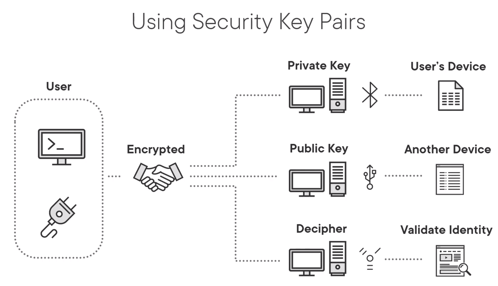
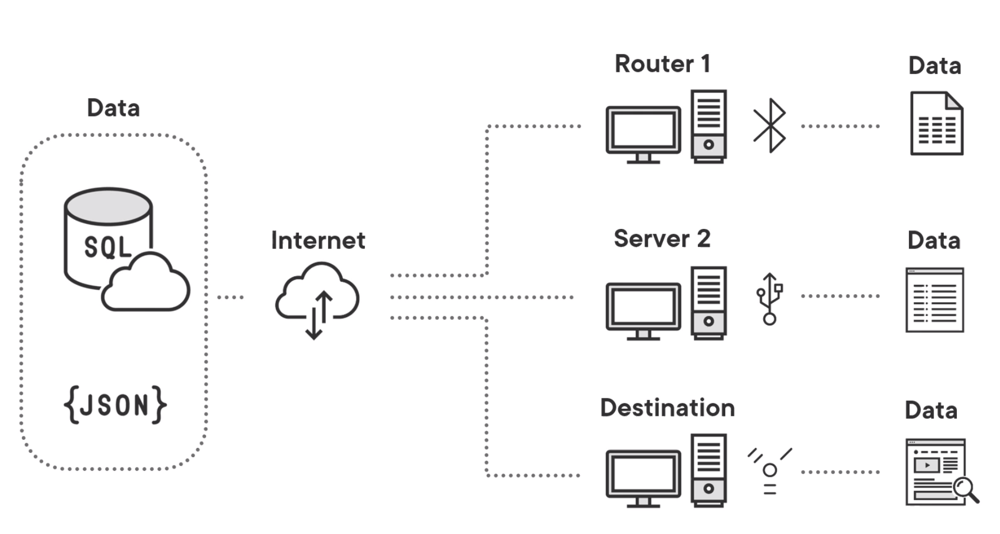
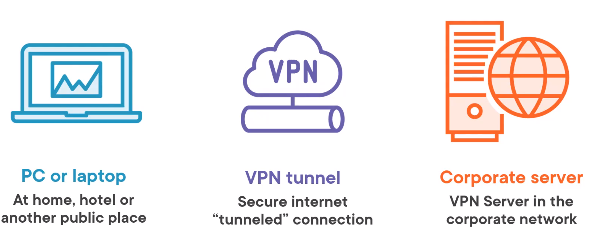

# Cloud Computing Fundamentals: Cloud Concepts

## 1. Course Overview

## 2. Cloud Principles

### 2.1 Introduce to Cloud Computing

**Cloud computing** 

The technology which is Internet based and represented as a cloud graphic.

**Cloud Services**

e.g. Gmail / Netflix / Salesforce


### 2.2 Cloud vs. On-premise

**On-premise** 内部部署

- Hardware (Processor, memory, hard drive, etc.)
- Operating System (Integrated with hardware)
- Applications

**Why Cloud computing?**

- 更多的需求，导致了购买硬件和电子设备成本上涨；同时，还需要协同软件版本更新，系统兼容的问题。使得云计算，成为了更高效的选择。

**Cloud Computing**

- Renting computing resources
- Flexibility and scalability
- Access to latest technologies
- Enterprise-level data protection
- Reduced IT staff and admin costs

**Technology Pillars of Cloud Computing**  云计算的支柱

- ==Virtualization==: Not a one-to-one relationship between a physical server and a logical server

- ==Hypervisor==: Allows multiple OSs to share the same host, and manage the resource allocation to virtual OSs.

  > 它允许多个操作系统共享同一个主机，并管理虚拟操作系统的资源分配。


### 2.3 Cloud Service Models

**Models**

- Infrastructure as a Service (IaaS) = Virtual hardware, replace physical on premise IT infrastructure.
- Platform as a Service (PaaS) = Add feature to *IaaS*, like OS, software development tools and IDE.
- Software as a Service (SaaS) 

**Infrastructure as a Service (IaaS)** 

- Virtual hardware ---X---> physical one
- Scale up or down based on needs. 可扩展性
- Pay for what you use
- 物联网 (Internet of Things IoT )的动力
- High-performance computing
- Data storage, backup and recovery

Covers 3 aspects

- Compute: 按需提供计算资源
- Block Storage：提供可用于存储信息的块
- Network：提供网络能力所需的资源

**Platform as a Service (PaaS) **

- OSs and software
- Runtime environments
- Allows developers to focus on app
- Provisioning and deployment
- Load balancing and autoscaling
- APIs, DevOps, Integration and ML

Covers 3 Aspects

- Object storage = providing resources on how object are stored.
- Identity = 提供一个处理用户身份验证的层
- Runtime = 为应用程序运行提供了运行时层
- Queue = 用于批处理和消息处理
- Database 

**Software as a Service (SaaS)** 

- Apps are accessed over Internet
- largest of the three models
- Monthly or yearly subscription fee
- Internet connection is required
- Biggest concern is data security

Cover Aspects

- Monitoring
- Content
- Collaboration
- Communication
- Finance

**Other Models**

- Business Processes (BPaaS)  = 工资单，IT帮助或者其他服务等流程业务
- Communications (CaaS) = 提供IP
- Machine Learning (MLaaS)
- Databases (DBaaS) = out-of-box db of sql/nosql
- Funcitons (FaaS)


### 2.4 Cloud Deployment Models

Good Cloud Deployment Models offer the best in :

- scalability
- reliability
- flexibility
- geographical independence
- cost effectiveness

**Public Clouds** 公有云

- Whatever the client wants, the client gets
- *More resources needed, simply scales up and uses more.*
- Pays more.
- Operated by the third-party companies. e.g. Amazon, Microsoft Azure

**Private Cloud** 私有云

- Purchase virtualization software
- Set up individual clouds
- Limited scalability
- Control all its own security

**Hybrid Cloud** 公有云

- Combines public and private clouds
- Storage of sensitive info privately
- Tight control of data

**Community Cloud** 社区云

- 共同目标和兴趣的组织，schools / company
- Clients know who the other clients are
- Less scalability and flexibility

[Learn more about types](https://aws.amazon.com/types-of-cloud-computing)


### 2.5 Characteristics of Cloud Computing

**Characteristics** 

- ***Elastic*** - grow or shrink as the client's needs change
- ***Resource pooling* -** divided among clients as needed
- *Rapid elasticity* - fast allocation of resources
- ***Self-service*** - automatically access any resources, at any time.
- ***Scalability*** - ability to use more or fewer resources
- ***Broad network access*** - resources accessible over the network
- ***Pay as you go*** - you pay for what you use and when you use it.
- ***Availability*** - resources are accessible when a client needs them.


### 2.6 Shared Responsibility Models

**Responsibility 构建**

- Customer - 负责 cloud 内部的安全
- Provide - 负责 Infrastructure & services security

> 前提：不联网，不会有安全问题

**Customer responsibility**

- Customer data
- Platform, applications, identity, and access management
- OS, network, firewall configuration
- Network traffic, file system, data encryption and integrity

**Provider responsibility**

- Compute
- Storage/DB
- Networking
- Regions/ Availability zones / Edge locations


# 3. Cloud Networking Concepts

##  3.1 Network Fundamentals

互联网的本质：two or more devices that communicate with each other.

Network client: devices be used to communicate. Also, is part of every OS system.

**Networking**

- (Built-in) Network adapter = Network Interface Card (NIC) 
  - 作用：允许和启用设备在网络上进行通信。
  - 注意：两个设备互相通信的前提，使用相通技术的网卡。`移动设备无法在蓝牙网络上通信`
- Transmission method
  - 作用：How data travels from device to device
- Protocol
  - 作用：Language used for communication.


## 3.2 Protocols

**TCP/IP (Transmission Control Protocol / Internet Protocol)**

- The protocol of the Internet.

> 为实现通信，每个设备使用以下4个级别中的每个级别的一个组件：流程应用协议

**TCP / IP Protocol Suite Levels**

- *Process application*: Telnet, RDP, SSH, FTP, DHCP, SMTP, and HTTP(S)

- *Host-to-host:* TCP and UDP
- *Internet protocols:* IP, ICMP, ARP, and RARP
-  *Network access:* Ethernet, Fast, Gigabit, and Wi-Fi(802.11)

> Most protocols are at the process application layer.


## 3.3 Common Access Types

> IF an organization needs permanent access to the cloud, then a browser might not be enough.

**Cloud Access Types**

- HTTP(S) =  Hypertext Transfer Protocol (Secure)
- RDP = Remote Desktop Protocol `Link to remote device`
- SSH = Secure Shell (mostly on Linux)
  - Linux 的 RDP 到Windows 机器
- VPN = Virtual Private Network
  - 它通过互联网等公共网络进行的安全和专用网络连接。
- Direct = Direct connection to the cloud provider
  - 它在您的组织的现场网络和云提供商的网络之间提供物理连接。


## 3.4 HTTPS

**HTTPS**

> 对传输的信息加密。

HTTPS is in the Process application layer of TCP/IP suite.

Secure TCP/IP application protocol designed to fetch web pages and encrypt data that is *transmitted between a web server and its client.*

**HTTP**

> 对传输的信息不加密。

An alternative to HTTPS, and it ==does not encrypt transmissions==.

**HTTPS - Key Features**

- ***Mostly using web browsers*** - Designed to request web pages from web servers.
- ***Provider*** - Responsible for security of the cloud (infrastructure and services).


## 3.5 RDP

> 云计算的好处是能够创建虚拟机。（对于有权限的人员）

Created Linux/Windows server will act like any other Windows server and do anything else users need a server to do. ==NO NEED to buy hardware==

**Virtual Server Uses**

- ***Extra capacity*** - Almost instantaneously.
- ***End-to-end testing*** - Using different platforms
- ***Staging*** - Different environments.

**RDP** - a protocol used to log into an online Windows server instance.

**RDP Access**

- Windows includes an RDP client called Remote Desktop Connection.
- Other OS got other RDP clients.
- RDP require the use of a public/private key pair to authenticate user.

**Using Security Key Pairs**




- 产生一对公钥和私钥。私钥存储在User的设备上，公钥存储在用户想要连接的远程设备）。
- 使用公钥和私钥进行身份认证，成功后即可连接。


## 3.6 SSH

> 类似于Linux上的RDP协议。

In its most simple form, SSH runs as a text command from a command prompt.

```powershell
ssh -i "QDt1.pem" Ubuntu@ec2-13-58-100-31.us-east-2.compute.amazonaws.com
```

- `-i` + secure file
- `Ubuntu` - User name
- internet address

**SSH client**

- PuTTY, OpenSSH


## 3.7 VPN

**Public Internet**



- Data send from server A ----- server B. The process data will bounces between many routers, before data get to server B.
- Data can be read by hacker.

**VPN** - a secure and private network connection that occurs through a public network.

- Another way to protect information.

**VPN Architecture**

A point-to-point tunnel.



**VPNs vs. VLANs**

| VPNs              | VLANs                                                        |
| ----------------- | ------------------------------------------------------------ |
| Uses the Internet | Be configured on a network switch<br />Places several computers together on their own local network segment. |


## 3.8 Direct Connect

Provide direct connect between local and cloud server.

**Direct Connect Criteria**

- If many user need persistent access to cloud services.
- There is a large amount of data transferred between the cloud and the on-site network.

**Direct Connect Features**

- Cloud providers offer connections that support 100 Gbps data transfers
- Price : $\$50/month$ ~ $\$50,000/month$ 


## 3.9 Software-defined Networking

> Separating the network packets / infrastructure layer, from the decision-making process / control layer. ---> ***Make network more flexible***

**Routers Features**

- Process incoming data packets.
- Read the destination address
- Transmit the packet on to the next network

**Router Parts**

- ***Physical*** - Internal circuits which makes routing possible
- ***Logical*** - Table used to determine where to transmit the packets


## 3.10 Load Balancing

**Loud Balancing**

- Conceived before the cloud.  接收外界信息。
- Act like the web server to outside world.
- Load balancer sends the request to the real servers.

**Configurations**

- ***Cross-region*** - Based on IP address routing.
- ***Content-based*** - Based on types of requests. e.g. `web pages / vedios / upload & download`

**Benefits**

- Performance - 使用多地域的计算资源
- Scalability - 有需求时，可以扩展机器；不使用时，可以关闭机器。
- Reliability - 有自然灾害时，可以使用周边的机器顶上。


## 3.11 Domain Name System

> A device requires an IP address to connect to a site.

DNS -- to match URLs to IP addresses.

**How DNS Works**

- DB that contains hostname-to-IP-address pairs (zone file).
- Other DNS servers can be checked to fulfill the request.

**Protocols and Ports**

> IP address + Port = socket

- DNS 53
- HTTP 80
- HTTPS 443
- RDP 3389
- SSH 22


## 3.12 Firewalls

Firewalls filter network traffic based on rules defined by an administrator.

**Firewalls**

- Anti-malware checks files for threats
- Firewalls protect you from network traffic that could be dangerous.

**Firewall Types**

- ***Network-based*** - Protects a whole network. MOSTLY hardware based.
- ***Host-based*** - Protects a single computer. MOSTLY software based.

**How Firewalls Work**

- Public
- Private
- DMZ (between public and private)

**Firewalls Configuration**

- ***Default deny***
- ***ACL*** - block IP, domain names, ...
- ***Inbound/Outbound***


# 4. Cloud Storage Concepts

4.1 Understanding Cloud Storage


4.2 Storage Characteristics


4.3 Storage Types and Features


4.4 Content Delivery Networks
