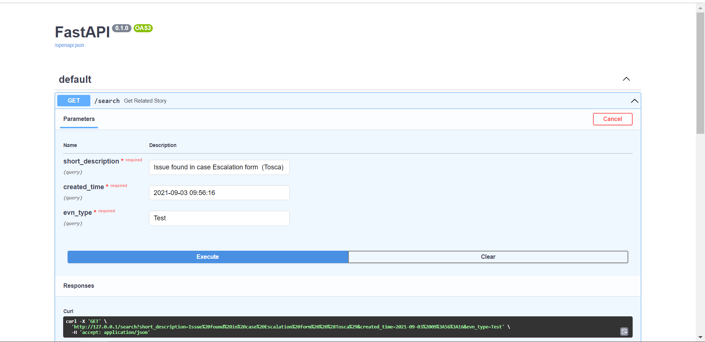

### 3. Fastapi in Containers - Docker

> Learn more: [link](https://fastapi.tiangolo.com/deployment/docker/).
>
> You will have a directory structure like:
>
> **ATF-python_crawler**
> ├── **app**
> │	├── **response**
> │	│    └── stories.py
> │	├── **search**
> │	│    └── elastic_search.py
> │	├── **tools**
> │	│    └── word_npl_util.py
> ├── \__init__.py
> ├── main.py   
> ├── Dockerfile
> └── requirements.txt

1. **Pin the packages version in** `requirements.txt` .

   For example, your `requirements.txt` could look like:

   ```yaml
   fastapi>=0.68.0,<0.69.0
   pydantic>=1.8.0,<1.10.0,!=1.8.1,!=1.8
   uvicorn>=0.15.0,<0.16.0
   uvicorn
   jieba == 0.42.1
   spacy == 3.4.1
   rake-nltk == 1.0.6
   gensim == 3.8.1
   ```

2. **Create code.**

3. **Check your code**.

   `python -m uvicorn app.main:app --host 127.0.0.1 --port 80`

   > Run the code below, under your project directory. ( Here is the `ATF-python_crawler` package)

    If you can visit `http://127.0.0.1:80/docs` , can see an interface like this. Your app is run successfully, and can go on the next steps. Or you should check your app first.

   

4. **Create Dockerfile.** 

   ```dockerfile
   # Start from the official Python base image.
   FROM python:3.9
   
   # Set the current working directory to /code. p.s. where to put main, and requirements.txt
   WORKDIR /code
   
   # Copy the file with the requirements to the /code directory.
   COPY ./requirements.txt /code/requirements.txt
   
   # Install the package dependencies in the requirements file, and those needed for the nlp.
   RUN pip install --no-cache-dir --upgrade -r /code/requirements.txt
   RUN python -m spacy download en_core_web_sm
   RUN ["python", "-c", "import nltk; nltk.download('stopwords'); nltk.download('punkt')"]
   
   # Copy the ./main directory inside the /code directory.
   COPY ./app /code/app
   
   # Set the command to run the uvicorn server.
   CMD ["uvicorn", "app.main:app", "--host", "0.0.0.0", "--port", "80"]
   ```

5. **Build the Docker Image.**

   Build your FastAPI image: `docker build -t <name>`. 

   e.g. `docker build -t cetacean517/atf_search .`

   > Run the code below, under your project directory. ( Here is the `ATF-python_crawler` package)

6. **Start the Docker Container.** 

   Start the container: `docker run -d --name <name of container> -p <port>:<port> <name of image>`

   e.g. `docker run -d --name mycontainer -p 80:80 cetacean517/atf_search`

   > Run the code below, under your project directory. ( Here is the `ATF-python_crawler` package)

7. **Check your Docker Container**.

   Visit `http://127.0.0.1:80/docs` , and see whether you can see the page same as ***step3***.

8. **Push your Docker to DockerHub**

   Open a terminal and run the code below.

   ```
   docker login	// login your docker account
   docker images   // check the image your build 
   docker push cetacean517/atf_search:latest   // <dockeraccount-name>/<image-name>:<tag>
   ```

9. **Write an yaml file, and upload it to KYMA.**

   ```yaml
   apiVersion: apps/v1
   kind: Deployment
   metadata:
     name: atf-search
     namespace: kube-public
     labels:
       app.kubernetes.io/name: atf-search
   spec:
     replicas: 1
     selector:
       matchLabels:
         app: atf-search
     template:
       metadata:
         labels:
           app: atf-search
           version: v1
       spec:
         containers:
           - name: atf-search
             image: 'cetacean517/atf_search:latest'
             resources:
               requests:
                 memory: 256Mi
                 cpu: 256m
               limits:
                 memory: 256Mi
                 cpu: 256m
         ports:
         - containerPort: 80
           name: request
   ---
   apiVersion: v1
   kind: Service
   metadata:
       name: atf-search-service
       labels:
           app: atf-search
   spec:
       ports:
       - port: 80
         name: request
         targetPort: 80
       selector:
           app: atf-search
   ---
   apiVersion: gateway.kyma-project.io/v1alpha1
   kind: APIRule
   metadata:
       name: atfrequest
   spec:
       gateway: kyma-gateway.kyma-system.svc.cluster.local
       service:
           name: atf-search-service
           port: 80
           host: atf-search
       rules:
           - accessStrategies:
               - config: {}
                 handler: allow
             methods:
               - GET
             path: /.*
   ```

   10. **Check it again.**