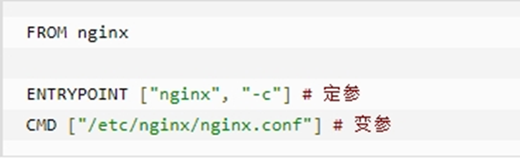
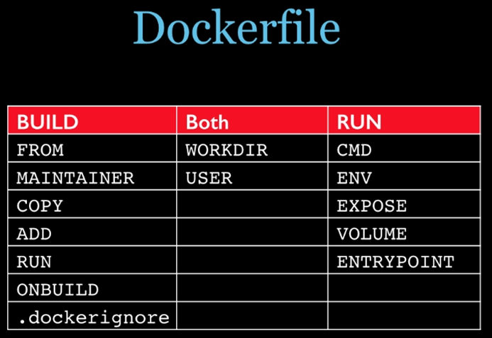
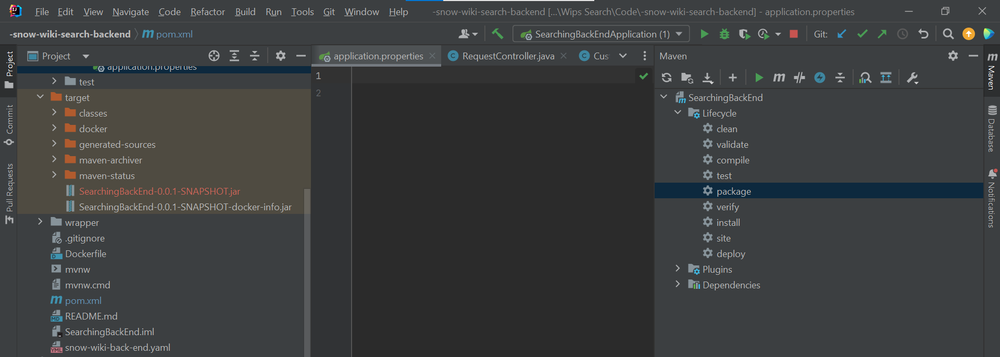

# Docker


## Docker 基础命令

### 常用启动类命令   

- 启动docker： systemctl start docker
- 停止docker： systemctl stop docker
- 重启docker： systemctl restart docker
- 查看docker状态： systemctl status docker
-  开机启动： systemctl enable docker
-  查看docker概要信息： docker info
- 查看docker总体帮助文档： docker --help
-  查看docker命令帮助文档： docker 具体命令 --help

### 镜像命令

- docker images
- docker search [OPTIONS] 镜像名字
- docker pull 某个XXX镜像名字：版本   `docker pull redis:6.0.8`
- docker system df 查看镜像/容器/数据卷所占的空间
- docker rmi 某个XXX镜像名字ID

### 容器命令

- docker run [OPTIONS] **IMAGE** [COMMAND] [ARG...]
- docker run -it centos /bin/bash 
- attach 直接进入容器启动命令的终端，不会启动新的进程 用exit退出，会导致容器的停止。
-  exec 是在容器中打开新的终端，并且可以启动新的进程 用exit退出，不会导致容器的停止。
- docker cp  容器ID:容器内路径 目的主机路径
- docker export 容器ID > 文件名.tar
- cat 文件名.tar | docker import - 镜像用户/镜像名:镜像版本号

## 容器卷

### 映射

容器内数据备份 + 持久化 到本机目录。

- 宿主vs容器之间映射添加容器卷：docker run -it --privileged=true -v /宿主机绝对路径目录:/容器内目录   镜像名

  `docker run -it --name u1 --privileged=true -v /tmp/myHostData:/tmp/myDockerData ubuntu`

- 查看数据卷是否挂载成功：docker inspect 容器ID

特点：

1：数据卷可在容器之间共享或重用数据。

2：卷中的更改可以直接实时生效。**（自动化）**

3：数据卷中的更改不会包含在镜像的更新中。

4：数据卷的生命周期一直持续到没有容器使用它为止。

### 读写权限

默认读写

docker run -it --privileged=true -v /宿主机绝对路径目录:/容器内目录:**rw**   镜像名

- rw 读写
- ro 只读

### 继承与共享

docker run -it --privileged=true --volumes-from 父类 --name u2 ubuntu

## DockerFile

编写DockerFile --- docker build 构建镜像 --- docker run 运行容器实例

#### 1. Dockerfile内容基础知识

1. 每条保留字指令都必须为大写字母且后面要跟随至少一个参数
2. 指令按照从上到下，顺序执行
3. #表示注释
4. 每条指令都会创建一个新的镜像层并对镜像进行提交

#### 2. DockerFile执行大致流程

DockerFile 原材料 --- Docker Images 软件交付品 --- Docker Container 实际产品

1. docker从基础镜像运行一个容器
2. 执行一条指令并对容器作出修改
3. 执行类似docker commit的操作提交一个新的镜像层
4. docker再基于刚提交的镜像运行一个新容器
5. 执行dockerfile中的下一条指令直到所有指令都执行完成

#### 3. DockerFile 保留字

FROM ：基础镜像，当前新镜像是基于哪个镜像的。指定一个已经存在的镜像作为模板，第一条必须是from

MAINTAINER：镜像维护者的姓名和邮箱地址

RUN：容器构建时需要运行的命令

- shell格式   RUN < 命令行命令>;     e.g. `RUN yum -y install vim`

- exec格式    RUN ["可执行文件"，"参数1"，"参数2"]

EXPOSE：当前容器对外暴露出的端口

WORKDIR：指定在创建容器后，终端默认登陆的进来工作目录，一个落脚点

USER：指定该镜像以什么样的用户去执行。默认是root。（一般不指定）

ENV：用来在构建镜像过程中设置环境变量。

- ENV MY_PATH /usr/mytest 
- 比如：WORKDIR $MY_PATH ， 这里 MY_PATH = /usr/mytest

**ADD**：将宿主机目录下的文件拷贝进镜像，且会自动处理URL和解压tar压缩包。（COPY + 解压）

COPY：类似ADD，拷贝文件和目录到镜像中。 将从构建上下文目录中 <源路径> 的文件/目录复制到新的一层的镜像内的 <目标路径> 位置。

- COPY src dest
- COPY ["src", "dest"]
- <src源路径>：源文件或者源目录
- <dest目标路径>：容器内的指定路径，该路径不用事先建好，路径不存在的话，会自动创建。

VOLUME：容器数据卷，用于数据保存和持久化工作

CMD：指定容器启动后的要干的事情。

- shell格式，exec格式
- Dockerfile 中可以有多个 CMD 指令，**但只有最后一个生效，CMD 会被 docker run 之后的参数替换。** 

**CMD vs RUM**

-  CMD是在docker run 时运行。
- RUN是在 docker build时运行。

ENTRYPOINT：指定一个容器启动时要运行的命令

- 类似于 CMD 指令，但是ENTRYPOINT**不会被docker run后面的命令覆盖**， 而且这些命令行参数会被当作参数送给 ENTRYPOINT 指令指定的程序

假设已通过 Dockerfile 构建了 nginx:test 



| 是否传参         | 按照dockerfile编写执行          | 传参运行                                      |
| ---------------- | ------------------------------- | --------------------------------------------- |
| Docker命令       | docker run nginx:test           | docker run nginx:test  -c /etc/nginx/new.conf |
| 衍生出的实际命令 | nginx -c  /etc/nginx/nginx.conf | nginx -c /etc/nginx/**new.conf**              |



#### 4. 运行代码

编写：Dockerfile

```dockerfile
FROM centos
MAINTAINER zzyy<zzyybs@126.com>
 
ENV MYPATH /usr/local
WORKDIR $MYPATH
 
#安装vim编辑器
RUN yum -y install vim
#安装ifconfig命令查看网络IP
RUN yum -y install net-tools
#安装java8及lib库
RUN yum -y install glibc.i686
RUN mkdir /usr/local/java
#ADD 是相对路径jar,把jdk-8u171-linux-x64.tar.gz添加到容器中,安装包必须要和Dockerfile文件在同一位置
ADD jdk-8u171-linux-x64.tar.gz /usr/local/java/
#配置java环境变量
ENV JAVA_HOME /usr/local/java/jdk1.8.0_171
ENV JRE_HOME $JAVA_HOME/jre
ENV CLASSPATH $JAVA_HOME/lib/dt.jar:$JAVA_HOME/lib/tools.jar:$JRE_HOME/lib:$CLASSPATH
ENV PATH $JAVA_HOME/bin:$PATH
 
EXPOSE 80
```

构建：docker build -t 新镜像名字:TAG **.** 

运行：docker run -it 新镜像名字:TAG

## 部署 Spring-boot到dockerhub

1. Spring-boot项目生成jar包

   Maven - 刷新 - 自己的maven工程 - package - 运行

   

2.  在 powershell 中推送本地镜像去仓库

   - docker login

   - docker push cetacean517/search-backend: 0.0.1-SNAPSHOT(TAG)

## Docker-compose 多服务部署的工具

管理多个镜像，编排容器顺序。

#### 1. 核心

文件：**docker-compose.yml**， 服务（容器），工程（编排多个容器）

#### 2. 步骤

- 编写Dockerfile，定义各个微服务应用，并构建对应的镜像文件
- 使用docker-compose.yml 定义完整业务单元，编排各个容器服务。
- 执行 docker-compose up 命令，启动部署上线。

#### 3. Compose常用命令

docker-compose -h              # 查看帮助

docker-compose up              # 启动所有docker-compose服务

docker-compose up -d            # 启动所有docker-compose服务并后台运行

docker-compose down             # 停止并删除容器、网络、卷、镜像。

docker-compose exec  yml里面的服务id         # 进入容器实例内部 docker-compose exec docker-compose.yml文件中写的服务id /bin/bash

docker-compose ps           # 展示当前docker-compose编排过的运行的所有容器

docker-compose top           # 展示当前docker-compose编排过的容器进程

 

docker-compose logs  yml里面的服务id   # 查看容器输出日志

dokcer-compose config   # 检查配置

dokcer-compose config -q # 检查配置，有问题才有输出

docker-compose restart  # 重启服务

docker-compose start   # 启动服务

docker-compose stop    # 停止服务

#### yaml

docker-compose.yml文件

```yaml
version: "3"
 
services:   # 代表有几个服务容器
  microService:		# 自定义的服务名
    image: zzyy_docker:1.6
    container_name: ms01
    ports:
      - "6001:6001"
    volumes:
      - /app/microService:/data
    networks: 
      - atguigu_net 
    depends_on: 
      - redis
      - mysql
 
  redis:
    image: redis:6.0.8
    ports:
      - "6379:6379"
    volumes:
      - /app/redis/redis.conf:/etc/redis/redis.conf
      - /app/redis/data:/data
    networks: 
      - atguigu_net
    command: redis-server /etc/redis/redis.conf
 
  mysql:
    image: mysql:5.7
    environment:
      MYSQL_ROOT_PASSWORD: '123456'
      MYSQL_ALLOW_EMPTY_PASSWORD: 'no'
      MYSQL_DATABASE: 'db2021'
      MYSQL_USER: 'zzyy'
      MYSQL_PASSWORD: 'zzyy123'
    ports:
       - "3306:3306"
    volumes:
       - /app/mysql/db:/var/lib/mysql
       - /app/mysql/conf/my.cnf:/etc/my.cnf
       - /app/mysql/init:/docker-entrypoint-initdb.d
    networks:
      - atguigu_net
    command: --default-authentication-plugin=mysql_native_password #解决外部无法访问
 
networks: 
   atguigu_net: 

```


