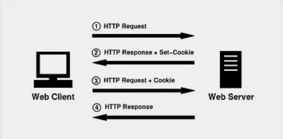
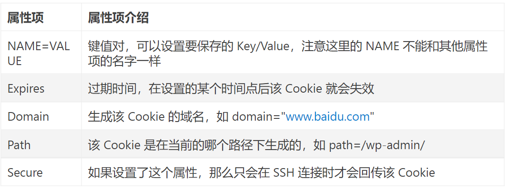

# Cookie

Link1: https://www.jianshu.com/p/6fc9cea6daa2

1. 什么是cookie，cookie的作用
2. cookie的工作机制，即cookie是运作流程
3. cookie的基本属性（4个）以及我们如何使用cookie

## 1. What is cookie

- 一小段 key-value格式的文本信息。
- 用于身份验证。

## 2. How does cookie work

- 客户端 ---- 【请求】 --- 服务器
- 服务器 【记录用户状态】 ---- 【返回Cookie：HttpResponse 响应 （Set-Cookie 头部）】 ---- 客户端
- 客户端 【再次访问】 ---- 【请求：HttpRequest包含Cookie头部 】 ---- 服务器
- 服务器 【识别Cookie】 ---- 【允许用户登录， 跳过验证】 ---- 客户端

## 3. Cookie Attribution

Expires: Cookie的有效期。

- getMaxAge() ;
- setMaxAge(int maxAge): maxAge = 正（有效期，持久化）/ 负（临时，不持久）/  0 （立即删除Cookie)

## 4. Develope of Cookie

### 4.1 Change or Delete

同名覆盖, maxAge设置为0. 没有直接删除方法。

所有属性，都要和原来一致。

### 4.2 Domain

Cookie 不可以跨域。

## Try

| Name                                                     | Value                                                        |
| -------------------------------------------------------- | ------------------------------------------------------------ |
| **_pk_id**.2bcdec4d-0cbd-440f-9602-6bdee004700f.89e4     | 4beb21f1d3ef9cc2.1658389028.0.1658389028..                   |
| **_swa_v_ref**.2bcdec4d-0cbd-440f-9602-6bdee004700f.89e4 | %5B%22%22%2C%22%22%2C1658389028%2C%22https%3A%2F%2Faccounts.sap.com%2F%22%5D |
| **_swa_v_ses**.2bcdec4d-0cbd-440f-9602-6bdee004700f.89e4 | *                                                            |
| **_swa_v_id**.2bcdec4d-0cbd-440f-9602-6bdee004700f.89e4  | c2da38e9e1d06d52.1658389028.1.1658389029.1658389028.         |
| **_ct_sso**                                              |                                                              |
| **_ct_remember**                                         |                                                              |
| JTENANTSESSIONID_r5gzobttiv                              |                                                              |
| BIGipServereu1internal.factory.customdomain              |                                                              |
| **_ct_se**                                               |                                                              |
| **_ct_session**                                          |                                                              |
| slo_regular_domains_eu1_r5gzobttiv_r5gzobttiv            |                                                              |
| JSESSIONID                                               |                                                              |

