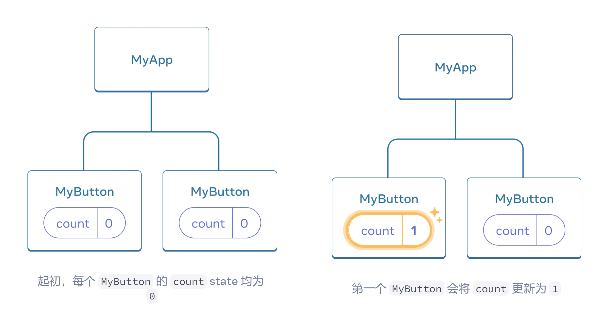

# React

## 1. Quick Start

> https://react.docschina.org/learnhttps://react.docschina.org/learn

### 1.1 创建和嵌套组件 

- React 组件是返回标签的 JavaScript 函数。
- 声明组建之后，可以嵌套。
- React 组件必须以大写字母开头，而 HTML 标签则必须是小写字母。
- `export default` 关键字指定了文件中的主要组件。

```js
function Hello(){
  return(
    <button> hello world!</button>
  )
}

export default function MyApp() {
  return (
    <div>
      <h1>Welcome to my app</h1>
      <Hello />
    </div>
  );
}
```

### 1.2 使用 JSX 编写标签 

JSX 比 HTML 更加严格。你必须闭合标签，如 `<br />`。你的组件也不能返回多个 JSX 标签。你必须将它们包裹到一个共享的父级中，比如 `<div>...</div>` 或使用空的 `<>...</>` 包裹

```js
function AboutPage() {
  return (
    <>
      <h1>About</h1>
      <p>Hello there.<br />How do you do?</p>
    </>
  );
}
```

### 1.3 添加样式

在 React 中，你可以使用 `className` 来指定一个 CSS 的 class。它与 HTML 的 [`class`](https://developer.mozilla.org/en-US/docs/Web/HTML/Global_attributes/class) 属性的工作方式相同

```js

```

你可以在一个单独的 CSS 文件中为它编写 CSS 规则：

```css
/* In your CSS */
.avatar {
  border-radius: 50%;
}
```

React 并没有规定你如何添加 CSS 文件。最简单的方式，你可以在你的 HTML 中添加一个 [``](https://developer.mozilla.org/en-US/docs/Web/HTML/Element/link) 标签。如果你使用了构建工具或框架，请阅读其文档，以了解如何将 CSS 文件添加到你的项目中。

### 1.4 显示数据 

JSX 会让你把标签放到 JavaScript 中。而大括号会让你 “回到” JavaScript 中。例如，显示 `user.name`

```js
return (
  <h1>
    {user.name}
  </h1>
);
```

将 JSX 属性 “转义到 JavaScript”，但你必须使用大括号 **而非** 引号。

例如，`className="avatar"` 是将 `"avatar"` 字符串传递给 `className`，作为 CSS 的 class。但 `src={user.imageUrl}` 会读取 JavaScript 的 `user.imageUrl` 变量，然后将该值作为 `src` 属性传递：

```js
return (
  
);
```

### 1.5 条件渲染 

- 使用 [`if`](https://developer.mozilla.org/en-US/docs/Web/JavaScript/Reference/Statements/if...else) 语句根据条件引入 JSX：

```jsx
let content;
if (isLoggedIn) {
  content = <AdminPanel />;
} else {
  content = <LoginForm />;
}
return (
  <div>
    {content}
  </div>
);
```

- 使用 [条件 `?` 运算符](https://developer.mozilla.org/en-US/docs/Web/JavaScript/Reference/Operators/Conditional_Operator)。与 `if` 不同的是，它工作于 JSX 内部：

```jsx
<div>
  {isLoggedIn ? (
    <AdminPanel />
  ) : (
    <LoginForm />
  )}
</div>
```

- 不需要 `else` 分支时，可以使用 [逻辑 `&&` 语法](https://developer.mozilla.org/en-US/docs/Web/JavaScript/Reference/Operators/Logical_AND#short-circuit_evaluation)：

```jsx
<div>
  {isLoggedIn && <AdminPanel />}
</div>
```

### 1.6 渲染列表 

例如，假设你有一个产品数组：

```jsx
const products = [
  { title: 'Cabbage', id: 1 },
  { title: 'Garlic', id: 2 },
  { title: 'Apple', id: 3 },
];
```

1. 使用[array 的 `map()` 函数](https://developer.mozilla.org/en-US/docs/Web/JavaScript/Reference/Global_Objects/Array/map) 来渲染组件列表。

```jsx
const listItems = products.map(product =>
  <li key={product.id}>
    {product.title}
  </li>
);

return (
  <ul>{listItems}</ul>
);
```

### 1.7 响应事件 

你可以通过在组件中声明 **事件处理** 函数来响应事件：

```jsx
function MyButton() {
  function handleClick() {
    alert('You clicked me!');
  }

  return (
    <button onClick={handleClick}>
      Click me
    </button>
  );
}
```

==注意==，`onClick={handleClick}` 的结尾没有小括号！不要 **调用** 事件处理函数：你只需 **传递给事件** 即可。当用户点击按钮时，React 会调用你的事件处理函数。

### 1.8 更新界面

通常，你会希望你的组件 “记住” 一些信息并展示出来。例如，也许你想计算一个按钮被点击的次数。要做到这一点，你需要在你的组件中添加 **state**。

首先，从 React 引入 [`useState`](https://react.docschina.org/reference/react/useState)：

```jsx
import { useState } from 'react';
```

现在你可以在你的组件中声明一个 **state 变量**：

```jsx
function MyButton() {
  const [count, setCount] = useState(0);
  // ...
```

你将从 `useState` 中获得两样东西：当前的 state（`count`），以及用于更新它的函数（`setCount`）。你可以给它们起任何名字，但按照惯例，需要像这样 `[something, setSomething]` 为它们命名。

第一次显示按钮时，`count` 的值为 `0`，因为你把 `0` 传给了 `useState()`。当你想改变 state 时，调用 `setCount()` 并将新的值传递给它。点击该按钮计数器将递增：

```jsx
function MyButton() {
  const [count, setCount] = useState(0);

  function handleClick() {
    setCount(count + 1);
  }

  return (
    <button onClick={handleClick}>
      Clicked {count} times
    </button>
  );
}
```

如果你多次渲染同一个组件，每个组件都会拥有自己的 state。

```jsx
import { useState } from 'react';

export default function MyApp() {
  return (
    <div>
      <h1>Counters that update separately</h1>
      <MyButton />
      <MyButton />
    </div>
  );
}

function MyButton() {
  const [count, setCount] = useState(0);

  function handleClick() {
    setCount(count + 1);
  }

  return (
    <button onClick={handleClick}>
      Clicked {count} times
    </button>
  );
}
```

注意，每个按钮会 “记住” 自己的 `count`，而不影响其他按钮。

### 1.9 使用 Hook 

以 `use` 开头的函数被称为 **Hook**。`useState` 是 React 提供的一个内置 Hook。你可以在 [React API 参考](https://react.docschina.org/reference/react) 中找到其他内置的 Hook。你也可以通过组合现有的 Hook 来编写属于你自己的 Hook。

Hook 比普通函数更为严格。你只能在你的组件（或其他 Hook）的 **顶层** 调用 Hook。如果你想在一个条件或循环中使用 `useState`，请提取一个新的组件并在组件内部使用它。

### 1.10 组件间共享数据 

每个组件state数据独立



若希望多个组件，state数据同时变化。为了使得 `MyButton` 组件显示相同的 `count` 并一起更新，你需要将各个按钮的 state “向上” 移动到最接近包含所有按钮的组件之中。

首先，将 `MyButton` 的 **state 上移到** `MyApp` 中：

```jsx
export default function MyApp() {
  const [count, setCount] = useState(0);

  function handleClick() {
    setCount(count + 1);
  }

  return (
    <div>
      <h1>Counters that update separately</h1>
      <MyButton />
      <MyButton />
    </div>
  );
}

function MyButton() {
  // ... we're moving code from here ...
}
```

接着，将 `MyApp` 中的点击事件处理函数以及 **state 一同向下传递到** 每个 `MyButton` 中。你可以使用 JSX 的大括号向 `MyButton` 传递信息。就像之前向 `` 等内置标签所做的那样:

```jsx
export default function MyApp() {
  const [count, setCount] = useState(0);

  function handleClick() {
    setCount(count + 1);
  }

  return (
    <div>
      <h1>Counters that update together</h1>
      <MyButton count={count} onClick={handleClick} />
      <MyButton count={count} onClick={handleClick} />
    </div>
  );
}
```

按这种方式传递下来的信息被称作 **prop**。此时，`MyApp` 组件包含了 `count` state 以及 `handleClick` 事件处理函数，并将它们作为 **prop 传递给** 了每个按钮。

最后，改变 `MyButton` 以 **读取** 从父组件传递来的 prop：

```JSX
function MyButton({ count, onClick }) {
  return (
    <button onClick={onClick}>
      Clicked {count} times
    </button>
  );
}
```

