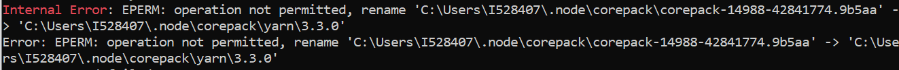
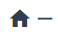

# Vue3 + Element-UI

## Resources

Vue 3: [Vue3 (vue3js.cn)](https://vue3js.cn/)

安装： https://v3.cn.vuejs.org/guide/installation.html#vite

Vuetify 样式库：https://vuetifyjs.com/zh-Hans/components/tooltips/

Element UI ：https://element-plus.org/zh-CN/guide/quickstart.html#%E5%AE%8C%E6%95%B4%E5%BC%95%E5%85%A5


## Version

- npm = 8.13.2
- @vue/cli = 5.0.6
- node = v16.15.1
- yarn = 3.3.0


## I. Init a project

> 前提条件
>
> - 熟悉命令行
> - 已安装 16.0 或更高版本的 [Node.js](https://nodejs.org/)

#### 1.1 创建Vue3项目

根据[文档](https://cn.vuejs.org/guide/quick-start.html)，创建vue3项目。

1. 安装并执行`create-vue`:  ` npm init vue@latest`
2. 配置项目信息

```Vue.js - The Progressive JavaScript Framework
√ Project name: ... scorecard_vue
√ Add TypeScript? ... No / Yes
√ Add JSX Support? ... No / Yes
√ Add Vue Router for Single Page Application development? ... No / Yes
√ Add Pinia for state management? ... No / Yes
√ Add Vitest for Unit Testing? ... No / Yes
√ Add an End-to-End Testing Solution? » No
√ Add ESLint for code quality? ... No / Yes
√ Add Prettier for code formatting? ... No / Yes
```

3. 进入并开启vue项目

```cmd
# npm 7+，需要加上额外的双短横线
$ cd <project-name>
$ npm install
$ npm run lint	# 修复错误配置
$ npm run dev
$ npm install -g sass # 安装sass （css工具）
```


#### 1.2 Install Element Framework

**1.2.1 Install Vuetify3** (后来没有使用，可以跳过)

> vuetify3支持vue3, 具体方式可参考：[link](https://next.vuetifyjs.com/en/getting-started/installation/#ssr). 本例采用[yarn](https://yarnpkg.com/getting-started/install)的安装方式。
>
> **Run cmd as administrator.**

1. Install Corepack : 

   ```bash
   corepack enable
   ```

2. Updating the global Yarn version

   Take a look at the [latest Yarn release](https://github.com/yarnpkg/berry/releases/latest), note the version number, and run:

   ```bash
   yarn set version stable
   ```

​		如果遇到如下问题，手动更改文件名和对应路径。即可解决。



3. Install Vuetify3

   ```cmd
   yarn add vuetify@^3.0.4
   ```

4. Add code to `main.ts`

   ```typescript
   import { createApp } from "vue";
   import App from "./App.vue";
   import router from "./router";
   
   import "./assets/main.css";
   
   // Vuetify
   import 'vuetify/styles'
   import { createVuetify } from 'vuetify'
   import * as components from 'vuetify/components'
   import * as directives from 'vuetify/directives'
   
   const vuetify = createVuetify({
       components,
       directives,
     })
   
   const app = createApp(App);
   
   app.use(vuetify);
   app.use(router);
   
   app.mount("#app");
   ```


**1.2.2 Install Element UI 3**

1. install 

```
 npm install element-plus --save
```

2. config `App.vue`

   ```vue
   // main.ts
   import { createApp } from 'vue'
   import ElementPlus from 'element-plus'
   import 'element-plus/dist/index.css'
   import App from './App.vue'
   
   const app = createApp(App)
   
   app.use(ElementPlus)
   app.mount('#app')
   ```

   

#### 1.3 Install Scss

https://juejin.cn/post/7036339518051467272

1. install

   ```cmd
   vue add style-resources-loader
   npm install node-sass sass-loader sass -D
   ```

2. vue.config.js 配置

   ```js
   module.exports = {
     pluginOptions: {
       'style-resources-loader': {
         preProcessor: 'scss',
         patterns: []
       }
     }
   }
   ```

3. Use

   ```html
   <style lang="scss">
       .box{
           .test{
           }
       }
   </style>
   ```

   

#### 1.4 Install [font](https://next.vuetifyjs.com/en/features/icon-fonts/)

1. install font lib

   ```cmd
   yarn add @mdi/font -D
   ```

2. Add code to `main.ts`

   ```typescript
   import '@mdi/font/css/materialdesignicons.css' // Ensure you are using css-loader
   
   export default createVuetify({
     icons: {
       defaultSet: 'mdi', // This is already the default value - only for display purposes
     },
   })
   
   import "./assets/main.css";
   
   const vuetify = createVuetify({
       components,
       directives,
       icons: {
           defaultSet: 'mdi'
         },
     })
   ```

3. Usage

   ```html
       <v-icon icon="mdi-home" />
       <v-icon icon="mdi-minus" /> // This renders a MDI icon
       <v-icon icon="mdi-cake"/>
   ```

   会显示对应的Material Design Icon

> 根据需求可配置多种icon，以及自定义icon. 
>
> MDI icon list 可以参考[这里](https://joe1900.github.io/MDI/)


## II. Config Router

配置router.ts，设置主页的路径。

```typescript
// router.ts
import { createRouter, createWebHistory } from "vue-router";


const router = createRouter({
  history: createWebHistory(import.meta.env.BASE_URL),
  routes: [
    {
      path: "/scorecard",
      name: "home",
      component: () =>import("../components/Home.vue"),
    }
  ],
});

export default router;

```


## III. Config global CSS

> 在assets > base.css / logo.svg / main.css 中配置全局样式。

```css
@import './base.css';

#app {
  max-width: 1600px;
  margin: 0 auto;
  /* padding: 2rem; */

  font-weight: normal;
}

a,
.green {
  text-decoration: none;
  color: hsla(160, 100%, 37%, 1);
  transition: 0.4s;
}


@media (min-width: 1024px) {		// 分情况显示界面
  body {
    display: flex;
    place-items: center;
  }

  #app {
    display: grid;
    grid-template-columns: 1fr 1fr;
    padding: 0 2rem;
  }
}
```
