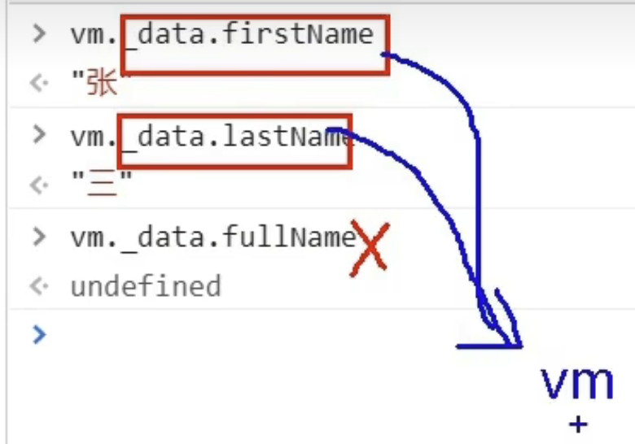

# Chapter 1 Vue 核心

https://www.yuque.com/cessstudy/kak11d/hfeef2

## 4. [el 与 data的两种写法](https://github.com/Cetacean517/vue-learning/blob/master/04_el%E5%92%8Cdata%E7%9A%84%E4%B8%A4%E7%A7%8D%E5%86%99%E6%B3%95/el%E5%92%8Cdata%E4%B8%A4%E7%A7%8D%E5%86%99%E6%B3%95.html)

对象式

```vue
// 对象式
data:{
 	...
}
```

函数式

```vue
// 函数式
data:function(){
	return{
		name: "cc"
	}
}
===========等价的==============
data(){
	return{
		name: "cc"
	}
}
```


## 5. [MVVM 模型](https://github.com/Cetacean517/vue-learning/blob/master/05_MVVM%E6%A8%A1%E5%9E%8B/mvvm%E6%A8%A1%E5%9E%8B.html)

vue 的差插值语法中可包含的内容：Vue实例中的所有内容


 (包括__proto__中的所有$xxx属性)

## 6.数据代理


## 7. 事件处理

### 7.1[事件的基本使用](https://github.com/Cetacean517/vue-learning/blob/master/07_%E4%BA%8B%E4%BB%B6%E5%A4%84%E7%90%86/%E4%BA%8B%E4%BB%B6%E5%A4%84%E7%90%86%E7%9A%84%E5%9F%BA%E6%9C%AC%E4%BD%BF%E7%94%A8.html)

1. 使用`v-on:xxx` 或 `@xxx` 绑定事件，其中xxx是事件名。
2. 事件的回调需要配置在methods对象中，最终会在vm上。
3. methods中配置的函数，不要使用箭头函数！否则this就不是vm了。
4. methods中配置的函数，都是被Vue所管理的函数，this的指向是vm或组件实例对象。
5. `@click="demo"` 和 `@click="demo($event)"`效果一致，但后者可以传参。


### 7.2 [事件修饰符](https://github.com/Cetacean517/vue-learning/blob/master/07_%E4%BA%8B%E4%BB%B6%E5%A4%84%E7%90%86/%E4%BA%8B%E4%BB%B6%E4%BF%AE%E9%A5%B0.html)

1. prevent: 阻止默认事件【常用】。

   对于绑定了点击事件的<a>标签，可以阻止点击完默认跳转。

2. stop：阻止事件冒泡【常用】。

3. once：事件只触发一次【常用】。

4. capture：使用事件的捕获模式。

5. self：只有event.target是当前操作的元素时才触发事件。

6. passive：事件的默认行为立即执行，无需等待事件回调执行完毕。

7. 事件修饰符可以连续写

   1. event.prevent.stop : 先阻止默认事件，再阻止冒泡。
   2. event.stop.prevent : 先阻止冒泡，再阻止默认事件。


### 7.3 [键盘事件](https://github.com/Cetacean517/vue-learning/blob/master/07_%E4%BA%8B%E4%BB%B6%E5%A4%84%E7%90%86/%E9%94%AE%E7%9B%98%E4%BA%8B%E4%BB%B6.html)

1. Vue中常用的按键别名

   | Name | KeyName                                      |
   | ---- | -------------------------------------------- |
   | 回车 | enter                                        |
   | 删除 | delete （捕获“删除Delete“和”退格Backspace“） |
   | 推出 | esc                                          |
   | 空格 | space                                        |
   | 换行 | tab                                          |
   | 上   | up                                           |
   | 下   | down                                         |
   | 左   | left                                         |
   | 右   | right                                        |

2. Vue为提供别名的按键，可以使用按键原始的key值去绑定，但注意要转为kebab-case（短横线命名）

   ```vue
   <input type="text" placeholder="caps-lock" @keyup.caps-lock="showInfo">
   ```

3. 系统修饰键（用法特殊）：ctrl, alt, ship, meta

   1. 配合keyup使用：按下修饰键的同时，再按下其他键，随后释放其他键，事件才被触发

      > 例：同时按下ctrl + y, 再松开y，事件才触发。

   2. 配合keydown使用：正常触发事件。

4. tab也要配合keydown才能正常使用。

   ```vue
   <input type="text" placeholder="tab" @keydown.tab="showInfo">
   ```

5. 可以使用keyCode去指定具体的按键

   ```vue
   <input type="text" placeholder="huiche" @keydown.13="showInfo">
   ```

6. Vue.config.keyCodes.自定义键名 = 键码，可以定制按键别名。

   ```vue
   <input type="text" placeholder="huiche" @keydown.huiche="showInfo">
   ```

7. 系统修饰符，同时按两个键才触发：
   1. @keyup.ctrl.y = "showInfo" : 同时按ctrl+y两个键才触发。


### 7.4 事件总结

1. 基本事件想传参就加"()"，否则可以不加。
2. 事件修饰符，日常前三个就够了。
3. 键盘事件，记第一组日常就够了。


## 8. 计算属性与监视

> 模板中如果使用到了data中的数据，如果数据改变一定会重新调取模板。

### 8.1 计算属性

1. 定义：要用的属性不存在，要通过已有属性（data中的数据）计算得来。

2. 原理：底层借助了Object.defineproperty方法提供的getter和setter。

3. get函数什么时候执行?

   1. 初次读取时会执行一次。
   2. 当依赖的数据发生改变时会被再次调用。

4. 优势：与methods实现相比，内部有缓存机制（复用），效率更高，调试方便。

5. 备注：

   1. 计算属性最终会出现在vm上，直接读取使用即可。
   2. 如果计算属性要被修改，那必须写set函数去响应修改，且set中要引起计算时依赖的数据发生改变。

6. computed设有缓存机制。

   > // e.g. 13-17行，第一次渲染页面的时候只会调用一次get方法。因为缓存的存在。

7. 计算属性不在`vm._data` 上，它是通过data中的数据计算后直接放在`vue` 实例上的。



```js
//html
//全名：<span>{{fullName}}</span><br/><br/>

computed:{
      fullName:{
          // get有什么作用？当有人读取fullName时，get会被调用，且返回值作为fullName的值。
          // computed设有缓存机制。
          // get什么时候调用？1. 初次读取fullName时。2.所依赖的数据发生变化时。
          // e.g. 13-17行，第一次渲染页面的时候只会调用一次get方法。因为缓存的存在。
          get(){
              // console.log("computed this", this)        // computed里get方法的this指向vm
              return this.firstName + '-' + this.lastName
          },
          // get什么时候调用？当fullName被修改时
          set(value){
              console.log('set-',value)
              const arr = value.split('-')
              this.firstName = arr[0]
              this.lastName = arr[1]
          }
      }
  }
```

