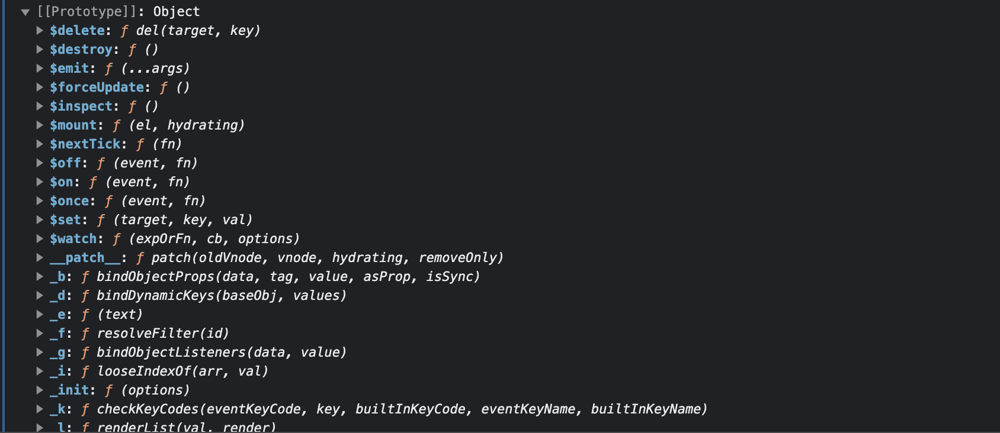

# Vue 核心

https://www.yuque.com/cessstudy/kak11d/hfeef2

## 3. el 与 data的两种写法

对象式

```vue
// 对象式
data:{
 	...
}
```

函数式

```vue
// 函数式
data:function(){
	return{
		name: "cc"
	}
}
===========等价的==============
data(){
	return{
		name: "cc"
	}
}
```


## 4. MVVM 模型 数据代理

vue 的差插值语法中可包含的内容：Vue实例中的所有内容


 (包括__proto__中的所有$xxx属性)