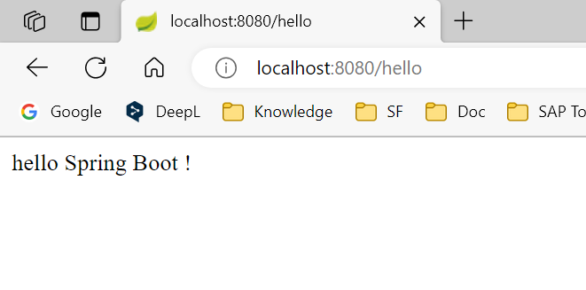
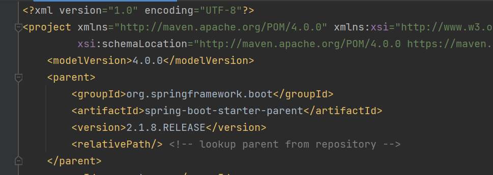
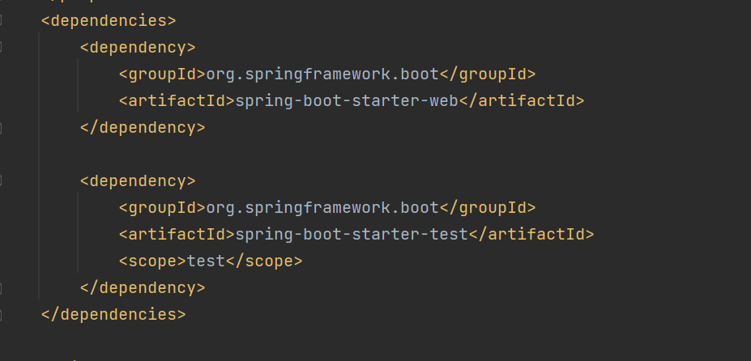
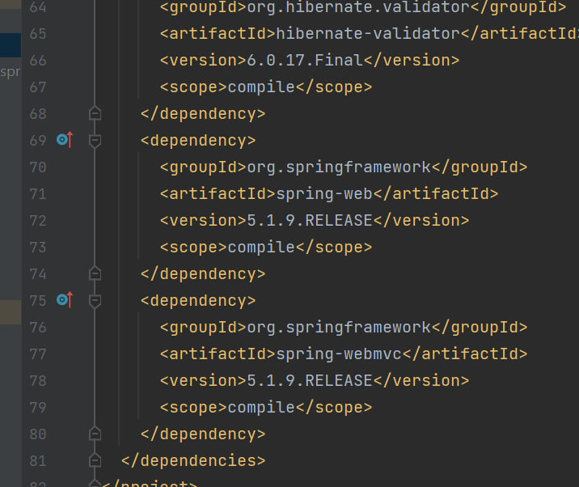
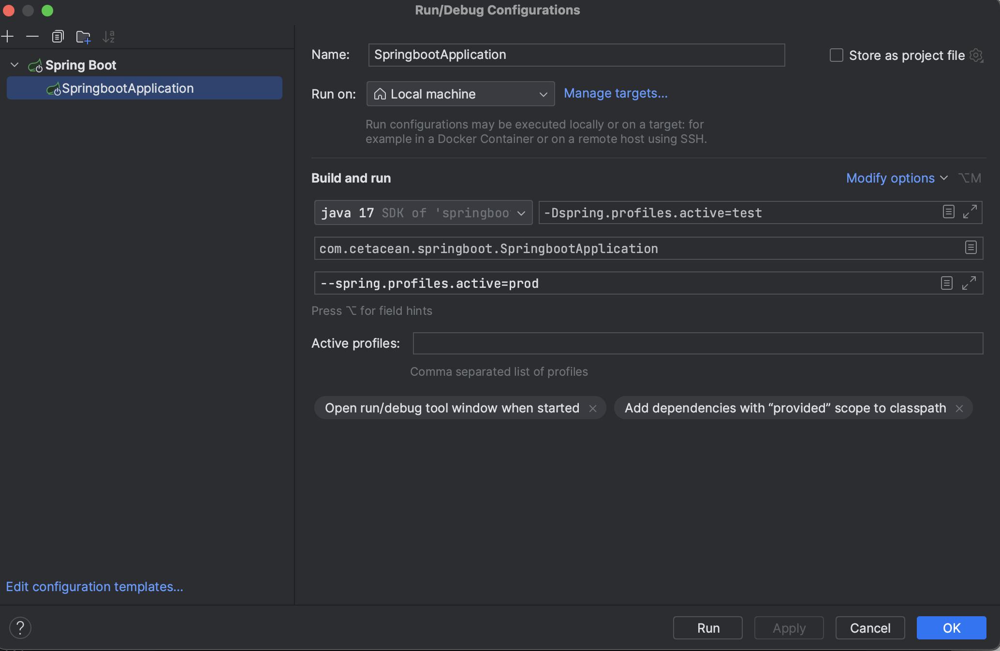
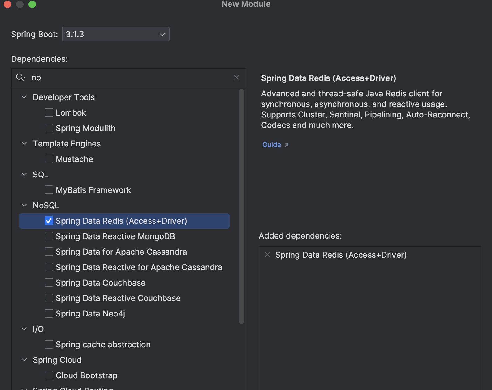

# SpringBoot Basic

[笔记参考 视频资料](https://www.bilibili.com/video/BV1Lq4y1J77x/?p=5&spm_id_from=333.1007.top_right_bar_window_history.content.click)

## 1. SpringBoot 概述

Spring boot 简化了Spring 的配置方式，基于约定由于配置的思想。提供了快速使用Spring项目的方式。

#### 1.1 Spring 缺点

- 配置繁琐
- 依赖繁琐

#### 1.2 SpringBoot 功能

1. ==自动配置==
2. ==起步依赖== ---- 传递依赖
3. 辅助功能 （嵌入式服务器，安全，指标...)


## 2. Springboot 快速入门

> 使用案例快速入门
>
> 官网构建Springboot文档：[这里](https://docs.spring.io/spring-boot/docs/current/reference/html/getting-started.html#getting-started.installing.java.maven)

### 2.1 hello world工程

案例需求

- 搭建SpringBoot工程，定义HelloController.hello()方法，返回Hello SpringBoot。

案例实现

1. 创建Maven项目

2. 导入SpringBoot起步依赖

   pom.xml

   ```xml
   <?xml version="1.0" encoding="UTF-8" standalone="no"?>
   <project xmlns="http://maven.apache.org/POM/4.0.0" xmlns:xsi="http://www.w3.org/2001/XMLSchema-instance" xsi:schemaLocation="http://maven.apache.org/POM/4.0.0 http://maven.apache.org/xsd/maven-4.0.0.xsd">
     <modelVersion>4.0.0</modelVersion>
     <groupId>org.cetacean</groupId>
     <artifactId>springboot-helloworld</artifactId>
     <version>1.0-SNAPSHOT</version>
   
     <!-- Inherit defaults from Spring Boot 需要继承的父工程 -->
     <parent>
       <groupId>org.springframework.boot</groupId>
       <artifactId>spring-boot-starter-parent</artifactId>
       <version>2.1.8.RELEASE</version>
     </parent>
   
     <!--    Web 开发的启动依赖-->
     <dependencies>
       <dependency>
         <groupId>org.springframework.boot</groupId>
         <artifactId>spring-boot-starter-web</artifactId>
       </dependency>
     </dependencies>
   
   </project>
   
   ```

3. 定义Controller

   ```java
   // src.java.com.demo.controller
   
   package com.demo.controller;
   
   import org.springframework.web.bind.annotation.RequestMapping;
   import org.springframework.web.bind.annotation.RestController;
   
   @RestController
   public class HelloController {
   
           @RequestMapping("/hello")
       public String hello(){
           return "hello Spring Boot !";
       }
   }
   ```

   

4. 编写引导类

   ```java
   package com.demo;
   
   import org.springframework.boot.SpringApplication;
   import org.springframework.boot.autoconfigure.SpringBootApplication;
   
   /*
   * 引导类 SpringBoot入口*/
   @SpringBootApplication
   public class HelloApplication {
       public static void main(String[] args) {
           SpringApplication.run(HelloApplication.class,args);
       }
   }
   
   ```

   

5. 启动测试

- 运行引导类

- 打开浏览器，输入网址`http://localhost:8080/hello`

- 显示如下

  

#### 小结

- 创建项目时，使用jar的打包方式
- 引导类是项目入口，运行main方法启动项目。
- SpringBoot和Spring项目，业务代码编写方式一致。


### 2.2 Idea 模板构建项目

案例需求

- 使用Idea快速构建SpringBoot工程。
- 定义HelloController.hello()方法，返回Hello SpringBoot。

案例实现

方法一：  Idea中直接构建

`New Module` --- `Spring Initializer` 

https://blog.csdn.net/weixin_46721191/article/details/130364550

- `Next` ---- 修改 `Group + Artifact + Type + Language ....` + `Next` --- `Choose Dependencies `

方法二：spring.io官网上构建


## 3. SpringBoot 起步依赖原理分析

### 3.1 起步依赖原理分析

1. spring-boot-starter-parent

   - 定义了版本的信息。
   - 点击`spring-boot-starter-parent`跳转至pom文件的顶层父类文件。（中间有两层，`spring-boot-dependencies-2.1.8.RELEASE.pom`)

   

   - 顶层父类文件包含：properties + propertyManagement
     - 主要作用是用于定义互相不冲突的常用的依赖版本。如果在pom.xml中定义了新的依赖，且依赖在父类文件中已经定义版本，则可以不添加版本使用自带的版本。（==避免版本冲突==）
     - 例：没有指定版本号，已经在父类中指定了。

   

2. spring-boot-starter-web

   - 依赖`spring-web`, `spring-webmvc`两个依赖。（依赖传递）
   - 

### 3.2 小结

- starter中，定义了完成该功能需要的坐标合集（依赖版本），其中大部分版本信息源于父工程。
- 新工程继承parent, 引入stater之后，通过依赖传递，方便使用jar包，且不会存在版本冲突问题。


## 4. SpringBoot  配置

### 4.1 配置文件分类

Springboot 很多配置都有默认值，但是也可以使用application.properties / application.yaml进行配置。

配置文件分类

- application.properites

  ```properties
  server.port=8080	// 修改默认端口
  
  name = xxx 				// 自定义参数，可以在方法中通过特定方法调用
  ```

- application.yaml / application.yml

  ```yaml
  server:
    port: 8080				# 修改默认端口
  ```

Springboot 配置加载顺序

- `application.properites` > `application.yaml`>`application.yml`
- 对于相同的配置，会读取高优先级中的内容。而对于高优先级中不存在的部份，会去后续文件中继续读取。（类似CSS的继承）

#### 小结

- Spring boot提供了2中配置文件类型：properties 和 yml/yaml

- 默认配置文件名称：application

- 在同一级目录下优先级为：properties > yml > yaml 

  

### 4.2 yaml

Yaml是一种直观的能够被电脑识别的数据格式。Yaml文件是以数据为核心的，比传统的xml方式更加简洁。

- properties

  ```properties
  server.port = 8080
  server.address = 127.0.0.1
  ```

- xml

  ```xml
  <server>
    <port>8080</port>
    <address>127.0.0.1</address>
  </server>
  ```

- yaml

  ```yaml
  server:
      port: 8080
      address: 127.0.0.1
  ```

  ==更为简洁，且结构清晰==

#### **YAML 语法**

- 大小写敏感
- 数据值前必须有空格，作为分隔符
- 使用缩紧表示层级关系
- 缩进时不允许使用Tab键，只允许使用空格（各个系统Tab对应的空格数据可能不同，但Idea可以使用）
-  缩进的空格数据不重要，只要相同层级的元素左侧对齐即可
- \# 表示注释, 从这个字符一直到行尾，都会被忽略

#### YAML 数据格式

- 对象: 键值对的集合

  ```yaml
  person:
  	name:	zhangsan
  
  # inline
  person: {name: zhangsan}
  ```

- 数组：一组按次序排列的值

  ```yaml
  address:
  	- beijing
  	- shanghai
  
  # inline
  address: [beijing, shanghai]
  ```

- ==纯量==，单个的，不可再分的值

  ```yaml
  msg1: 'hello \n world'  #单引号忽略转义字符
  msg2: "hello \n world"  #双引号识别转义字符
  ```

#### YAML 参数引用

```yaml
name: zhangsan

person:
  name: ${name}
```

#### 小结

- 配置文件类型
  - properties
  - yml/yaml 注意空格
- yaml：==简洁，以数据为核心==
  - 基本语法
    - 大小写敏感
    - 数据值前必须有空格，作为分隔符
    - 使用空格缩进表示层级关系，相同缩进表示同一级
  - 数据格式
    - 对象
    - 数组：使用“-”表示数组每个元素
    - 纯量
  - 参数引用
    - ${key}


### 4.3 读取配置文件内容

Shared yaml config

```yaml
server:
  port: 8080

full_name: Ce Ce

# object
person:
  name: ${full_name}
  age: 20
  address:
    - BJ
    - SH

# object inline
person1: {name: cece, age: 18}
address1: [beijing1, shanghai1]

```

#### @Value

```java
import org.springframework.beans.factory.annotation.Value;
import org.springframework.web.bind.annotation.RequestMapping;
import org.springframework.web.bind.annotation.RestController;

@RestController
public class HelloController {
	/** import config data by value **/
  // import meta data
    @Value("${full_name}")
    private String full_name;
  
  // import object
    @Value("${person.name}")
    private String name1;
    @Value("${person.age}")
    private String age1;
  
  // import array
    @Value("${address1[0]}")
    private String address1;

  
    @RequestMapping("/hello2")
    public String hello2(){
        System.out.println(full_name);
        System.out.println(name1);
        System.out.println(age1);
        System.out.println(address1);
        return "hello Spring Boot222 !";
    }

}

// Output
// Ce Ce
// cece
// 18
// beijing1
```


#### Environment

先引入Environment的实例，通过该实例进行调用。

```java
// import ...
import org.springframework.beans.factory.annotation.Autowired;
import org.springframework.core.env.Environment;

@RestController
public class HelloController {
	/** import config data by Environment **/
    @Autowired
    private Environment env;

  
    @RequestMapping("/hello2")
    public String hello2(){
      // import object data
			System.out.println(env.getProperty("person.name"));
      
      // import array data
      System.out.println(env.getProperty("address1[0]"));
        return "hello Spring Boot222 !";
    }

}

// Output
// Ce Ce
// cece
// 18
// beijing1
```


#### @ConfigurationProperties

将配置文件中的结构和java文件中的结构一一对应。

Entity

- @Component : 让springboot能够把它识别为bean
- @ConfigurationProperties(prefix = "person") 指定引入配置信息，并且以person开头。

```java
package com.cetacean.springboot;

import org.springframework.boot.context.properties.ConfigurationProperties;
import org.springframework.stereotype.Component;

@Component
@ConfigurationProperties(prefix = "person")
public class Person {
    private String name;
    private int age;

    private String[] address;

    public String getName() {
        return name;
    }

    public void setName(String name) {
        this.name = name;
    }

    public int getAge() {
        return age;
    }

    public void setAge(int age) {
        this.age = age;
    }

    public String[] getAddress() {
        return address;
    }

    public void setAddress(String[] address) {
        this.address = address;
    }

    @Override
    public String toString() {
        return "Person{" +
                "name='" + name + '\'' +
                ", age=" + age +
                '}';
    }
}

```

Controller

```java
// import ...
@RestController
public class HelloController {
	/** import config data by Environment **/
    @Autowired
    private Person person;

  
    @RequestMapping("/hello")
    public String hello(){
			System.out.println(person);
      String[] address = person.getAddress();
      for (String s : address) {
          System.out.println(s);
      }
        return "hello Spring Boot !";
    }

}

// Output
// Person{name='Ce Ce', age=20}
// BJ
// SH
```


#### 小结

- @Value 适合少量数据引入，且不支持直接导入列表/对象。
- Environment 适合导入所有的数据。
- @ConfigurationProperties 结构更为清晰，支持导入列表。

### 4.4 profile

用于配置切换生产，测试，开发环境。

#### 1. profile配置方式

- 多profile文件方式

  在resources目录下，创建多个配置文件

  ```properties
  # application-dev.properties
  server.port=8081
  ```

  ```properties
  # application-test.properties
  server.port=8082
  ```

  ```properties
  # application-prod.properties
  server.port=8083
  ```

  在没有激活的情况下，运行项目会自动开启8080端口。并且在terminal中显示如下内容：

  `No active profile set, falling back to 1 default profile: "default"`

  **激活方式**: 在主文件中激活

  ```properties
  # application-properties
  spring.profiles.active=dev
  ```

- #### yml多文档方式

  ```yml
  ---
  server:
    port: 8081
  spring:
    config:
      activate:
        on-profile: dev
  ---
  server:
    port: 8082
  spring:
    config:
      activate:
        on-profile: test
  ---
  server:
    port: 8083
  spring:
    config:
      activate:
        on-profile: prod
  ---
  spring:
    profiles:
      active: prod		# active production environment
  ```

  

#### 2. profile激活方式

- 配置文件: 见上一节

- 虚拟机参数

  Edit configuration -- VM-Option = `-Dspring.profiles.active=xxx`

  > 使用- D设置虚拟机信息

  

- 命令行参数

  可以在Idea编辑器中编辑，也可以在命令行中编辑。

  Edit configuration -- Program argument = `-spring.profiles.active=xxx`

  ```powershell
  # java -jar <jar_path> --spring.profiles.active=<env>
  
  java -jar ./springboot-0.0.1-SNAPSHOT.jar --spring.profiles.active=prod
  ```

#### 3.  小结

- profile是用来完成不同环境下，配置动态切换功能的。
- profile配置方式
  - 多profile文件方式：提供多个配置文件，每个代表一种环境
  - yml多文档方式：在yml中使用 ---分隔不同配置
- profile激活方式
  - 配置文件：再配置文件中配置：spring.profiles.active=dev
  - 虚拟机参数：在VM options指定：- DSpring.profiles.active=dev
  - 命令行参数：java -jar xxx.jar --spring.profiles.active=dev


### 4.5 内部配置加载顺序

Springboot 程序启动时，会从以下位置加载配置文件：

1. `file:./config/. `：当前项目下的/config目录
2. `file:./`：当前项目的根目录
3. `classpath:/config/`：classpath的/config目录
4. `classpath:`：classpath的跟目录

加载顺序为上文的排列顺序，高优先级配置的属性会生效


### 4.6 外部配置加载顺序

只有==java+resouces==会被打进jar包。因此，仅有`classpath`下的配置文件可以生效。

- 简单的命令可以通过命令行修改

`java -jar ./springboot-0.0.1-SNAPSHOT.jar --server.port=8083 --server.servlet.context-path=/cc`

- 复杂的命令可以通过外置的配置文件修改(加配置)

`java -jar ./springboot-0.0.1-SNAPSHOT.jar --spring.config.location=/Users/i528407/Documents/application.properties`

- 将application.properties和`.jar`文件放在同级，可以不加参数默认调用。

  ```
  -- .jar
  -- .properties
  ```

  ⚠️当同时存在`/target/config/application.properties` 和 `/target/application.properties` ，前者优先级更高。

## 5 Spingboot 整合其他框架

### 5.1 Junit

实现步骤

- 搭建Springboot工程
- 引入starter-test起步依赖
- 编写测试类
- 添加测试相关注解
  - @RunWith(SpringRunner.class)
  - @SpringBootTest(classes = 启动类.class)
- 编写测试方法 

***UserService***

```java
package com.cetacean.springboot.Service;

import org.springframework.stereotype.Service;

@Service
public class UserService {
    public void add(){
        System.out.println("add...");
    }
}

```

***UserServiceTest***

> 测试类的命名一般为：类名 + Test

```java
package com.cetacean.springboot.Service;

import org.springframework.stereotype.Service;

@Service
public class UserService {
    public void add(){
        System.out.println("add...");
    }
}

```

⚠️如果test下的结构和main中对应，那么`@SpringBootTest(classes = 启动类.class)`中的参数可以省略。


### 5.2 Redis

实现步骤

- 搭建SpringBoot工程

  创建项目，引入NOSQL-Spring Data Redis(Access+Driver)

  

- 引入redis起步依赖

  pom.xml 会根据配置自动导入依赖。

  ```xml
  		<dependency>
  			<groupId>org.springframework.boot</groupId>
  			<artifactId>spring-boot-starter-data-redis</artifactId>
  		</dependency>
  ```

- 配置redis相关属性

- 注入ResdisTemplate模板

- 编写测试方法，测试

  在测试目录下配置方法进行测试，要在本机的redis server上运行才能得到测试结果。

  ```java
  package com.cetacean.springbootredis;
  
  import org.junit.jupiter.api.Test;
  import org.springframework.beans.factory.annotation.Autowired;
  import org.springframework.boot.test.context.SpringBootTest;
  import org.springframework.data.redis.core.BoundValueOperations;
  import org.springframework.data.redis.core.RedisTemplate;
  
  @SpringBootTest
  class SpringbootRedisApplicationTests {
  
  	@Autowired
  	private RedisTemplate redisTemplate;
  
  	@Test
  	void testSet() {
  		// load in a data
  		redisTemplate.boundValueOps("name").set("zhangsan");
  	}
  
  	@Test
  	void testGet() {
  		// get data
  		Object name = redisTemplate.boundValueOps("name").get();
  		System.out.println(name);
  	}
  }
  ```

  

### 5.3 Mybatis

实现步骤

- 搭建SpringBoot工程
- 引入mybatis起步依赖，添加mysql驱动
- 编写DataSource和MyBatis相关配置
- 定义表和实体类
- 编写dao和mapper文件/纯注解开发
- 测试

DB data

```mysql
use `springboot`;
drop table if exists `t_usr`;

create table `t_usr` (
`id` int(11) not null auto_increment,
`username` varchar(32) collate utf8mb4_unicode_ci default null,
`password` varchar(32) collate utf8mb4_unicode_ci default null,
primary key (`id`)
)engine=InnoDB AUTO_INCREMENT=3 default charset=utf8mb4 collate=utf8mb4_unicode_ci;

insert into `t_usr` (`id`,`username`,`password`) values (1,'zhangsan','123'), (2,'lisi','234')
```

| id   | username | Password |
| ---- | -------- | -------- |
| 1    | Zhangsan | 123      |
| 2    | Lisi     | 234      |
|      |          |          |

Entity

```java
package com.cetacean.springbootmybatis.domain;

public class User {
    private int Id;
    private String username;
    private String password;

    public int getId() {
        return Id;
    }

    public void setId(int id) {
        Id = id;
    }

    public String getUsername() {
        return username;
    }

    public void setUsername(String username) {
        this.username = username;
    }

    public String getPassword() {
        return password;
    }

    public void setPassword(String password) {
        this.password = password;
    }

    @Override
    public String toString() {
        return "User{" +
                "Id=" + Id +
                ", username='" + username + '\'' +
                ", password='" + password + '\'' +
                '}';
    }
}
```

Properties.yml

```yaml
#datasource
spring:
  datasource:
    url: jdbc:mysql:///springboot?serverTimezone=UTC  # 配置时区
    username: root
    password: initial0
    driver-class-name: com.mysql.cj.jdbc.Driver
```

#### 1. 注解式开发

Mapper

```java
package com.cetacean.springbootmybatis.mapper;

import com.cetacean.springbootmybatis.domain.User;
import org.apache.ibatis.annotations.Mapper;
import org.apache.ibatis.annotations.Select;

import java.util.List;

@Mapper
public interface UserMapper {
    @Select("select * from t_usr")
    public List<User> findAll();

}

```

XML开发

Mapper

> 少了@Select注解

```java
package com.cetacean.springbootmybatis.mapper;

import com.cetacean.springbootmybatis.domain.User;
import org.apache.ibatis.annotations.Mapper;

import java.util.List;

@Mapper
public interface UserXmlMapper {
    public List<User>findAll();
}

```

Resources/mapper/mapper.xml

> 增加配置文件，namespace为实例的地址，ID是方法名

```xml
<?xml version="1.0" encoding="UTF-8"?>
<!DOCTYPE mapper PUBLIC "-//mybatis.org//DTD Mapper 3.0//EN" "http://mybatis.org/dtd/mybatis-3-mapper.dtd">
<mapper namespace="com/cetacean/springbootmybatis/mapper/UserXmlMapper.java">
    <select id="findAll" resultType="user">
        select * from t_usr
    </select>
</mapper>
```

yml

```yml
# mybatis
mybatis:
  mapper-locations: classpath:mapper/*Mapper.xml # mapper映射文件路径
  type-aliases-package: package com.cetacean.springbootmybatis.domain;
# config-location: # 指定mybatis的核心配置文件
```


