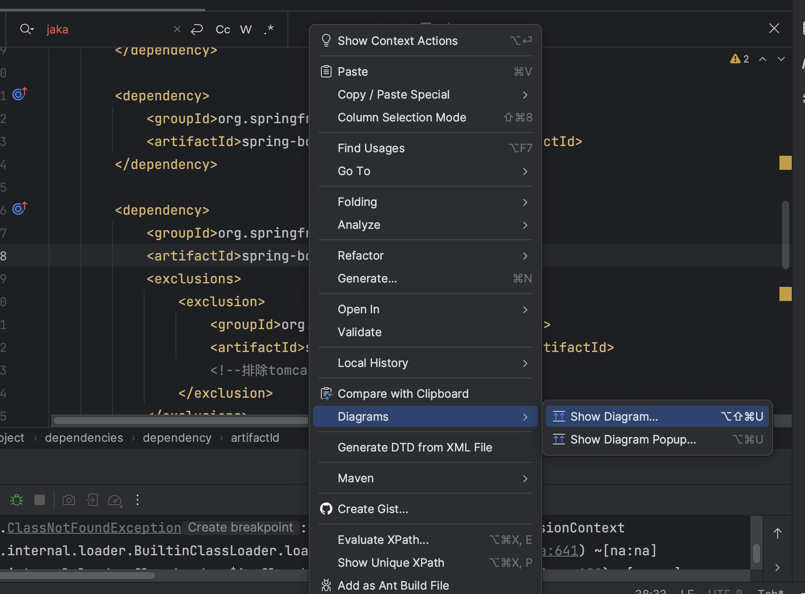
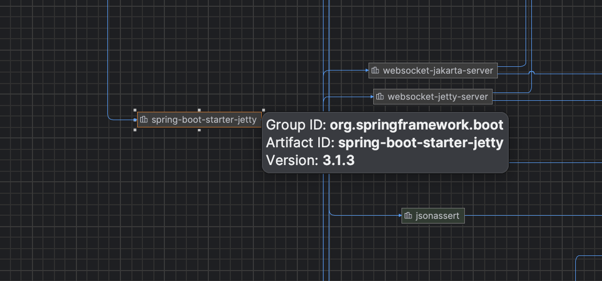

# Springboot Advance

## 1. SpringBoot 原理分析

### 1.1 自动配置

#### I. Condition

在Spring4.0新增的调节判断功能，实现***选择性创建Bean操作***。

##### 案例

> 在Spring的IOC容器中有一个User的Bean，现要求：
>
> 1. 导入Jedis坐标后，加载该Bean；没导入，则不加载。
> 2. 将类的判断定义改为动态的。判断哪个字节码文件，使用动态指定。

##### 实现 需求1

1. 创建一个User类

   ```java
   package com.cetacean.domain;
   
   public class User {
   }
   ```

   

2. 创建一个User Config类，用于创建User Bean。并且增加`@Conditional` 注解，使得在符合某些条件时，才创建Bean。

   ```java
   package com.cetacean.config;
   
   import com.cetacean.condition.ClassCondition;
   import com.cetacean.domain.User;
   import org.springframework.context.annotation.Bean;
   import org.springframework.context.annotation.Conditional;
   import org.springframework.context.annotation.Configuration;
   
   @Configuration
   @Conditional(ClassCondition.class)		// add condition by ClassCondition
   public class UserConfig {
       @Bean															// create Bean
       public User user(){
           return new User();
       }
   }
   ```

   ***==@Conditional==***

   `@Conditional` 注解，包含一个参数:  改参数是由Condition的子类组成的数组。

   ```
   Class<? extends Condition>[] value();
   ```

   `Condition` 是一个接口，包含一个方法：

   改方法可以定义匹配条件，根据匹配结果返回boolean值。

   ````java
   boolean matches(ConditionContext context, AnnotatedTypeMetadata metadata);
   ````

   

3. 导入Jedis依赖 --- maven reload

   ```xml
   		<dependency>
   			<groupId>redis.clients</groupId>
   			<artifactId>jedis</artifactId>
   			<version>4.3.1</version>
   		</dependency>
   ```

   

4. 创建一个Condition类，用于构建conditional注解的条件。

   ```java
   package com.cetacean.condition;
   
   import org.springframework.context.annotation.Condition;
   import org.springframework.context.annotation.ConditionContext;
   import org.springframework.core.type.AnnotatedTypeMetadata;
   
   public class ClassCondition implements Condition {
       @Override
       public boolean matches(ConditionContext context, AnnotatedTypeMetadata metadata) {
           // Check whether redis.clients.jedis.Jedis.class file exists.
           boolean flag = true;
           try {
             	// 1. load in bytecode file of jedis.
               Class<?> cls = Class.forName("redis.clients.jedis.Jedis");
           } catch (ClassNotFoundException e) {
             	// 2. If you cannot find the file, change flag to false.
               flag = false;
           }
         	// 3. return flag as result.
           return flag;
       }
   }
   
   ```

   - 当pom.xml中没有导入Jedis依赖时，运行main程序会报错：`no user bean...`
   - 反之，运行成功，并且答应user bean的信息。


##### 实现 需求2

1. 创建ClassOnCondition注解，将字节码文件类型作为注解的参数。

   ```java
   package com.cetacean.condition;
   import org.springframework.context.annotation.Conditional;
   import java.lang.annotation.*;
   
   // Annotation-config : 
   // Target: Set where the annotation is effective. 在变量和方法上生效。
   @Target({ElementType.TYPE, ElementType.METHOD})
   // Retention: Set when to be effective
   @Retention(RetentionPolicy.RUNTIME)
   // Documented: Can be load out into documents.
   @Documented
   // add Conditional annotation to class to inherit its function 
   @Conditional(ClassCondition.class) 
   public @interface ConditionOnClass {
       String[] value();		// To save the dynamic value of bytecode file
   }
   ```

2. 修改User Config类中的注解，替换为自定义注解

   ```java
   package com.cetacean.config;
   
   import com.cetacean.condition.ClassCondition;
   import com.cetacean.condition.ConditionOnClass;
   import com.cetacean.domain.User;
   import org.springframework.context.annotation.Bean;
   import org.springframework.context.annotation.Configuration;
   
   @Configuration
   @ConditionOnClass("redis.clients.jedis.Jedis")	// change the annotation
   public class UserConfig {
       @Bean
       public User user(){
           return new User();
       }
   }
   ```

3. 修改ClassConditon方法

   ***==Condition接口的 matches 方法==***

   ```java
   boolean matches(ConditionContext context, AnnotatedTypeMetadata metadata);
   ```

   - context:  上下问对象。用于获取环境，IOC容器，ClassLoader对象。
   - metadata: 注解的元对象。用于获取注解定义的属性值。

   ```java
   package com.cetacean.condition;
   
   public class ClassCondition implements Condition {
       /**
        *
        * @param context 上下文对象。用于获取环境，IOC容器，ClassLoader对象。
        * @param metadata 注解的元对象。用于获取注解定义的属性值。
        * @return
        */
       @Override
       public boolean matches(ConditionContext context, AnnotatedTypeMetadata metadata) {
           // Check whether specific bytecode file exists.
           // 1. Get annotation property value: value
           Map<String, Object> map = metadata.getAnnotationAttributes(ConditionOnClass.class.getName());
         // 2. Get all values from map
           String[] value = (String[]) map.get("value");
           boolean flag = true;
           try {
             // 3. Check if all className exits
               for (String className : value) {
                   Class<?> cls = Class.forName(className);
               }
           } catch (ClassNotFoundException e) {
               flag = false;
           }
           // 3. return flag as result.
           return flag;
   
       }
   }
   ```

##### 小结

- 自定义条件
  - 定义条件类：自定义类实现Condition接口，重写matches方法，在matches方法中进行逻辑判断，返回boolean值。matches方法有两个参数：
    - context：上下文对象，可以获取属性值，获取类加载器，获取BeanFactory等。
    - metadata：元数据对象，用于获取注解属性。
  - 判断条件：在初始化Bean时，使用`@Conditional` (条件类.class)注解
- SpringBoot提供的常用条件注解：
  - ConditionalOnProperty：判断配置文件中是否有对应属性和值才初始化Bean。
  - ConditionalOnClass：判断环境中是否有对应的字节码文件（类？）才初始化Bean。
  - ConditonalOnMissing：判断环境中是否有改Bean，没有对应Bean才初始化Bean。


#### II. 切换内置web服务器

SpringBoot的web环境中默认使用tomcat作为内置服务器，并提供四种服务器供我们选择。

> 内置服务器的文件夹：org.springframework.boot.autoconfigure.web.embedded
>
> - 配置文件  EmbeddedWebServerFactoryCustomizerAutoConfiguration
> - Jetty服务器 JettyWebServerFactoryCustomizer
> - Netty服务器 NettyWebServerFactoryCustomizer
> - Tomcat服务器 TomcatWebServerFactoryCustomizer
> - Undertow服务器 UndertowWebServerFactoryCustomizer

**实现**

1. 排除tomcat的默认依赖。

   进入pom.xml --- 右键 --- Diagrams --- Show Diagram --- 查看maven依赖关系图

   

   搜索 tomcat --- Shift + delete --- 排除依赖，在pom.xml 会新增一段exclusion代码。

   

2. 添加新的web服务器依赖。

   ```xml
   		<dependency>
   			<groupId>org.springframework.boot</groupId>
   			<artifactId>spring-boot-starter-web</artifactId>
   			<exclusions>
   				<exclusion>
   					<groupId>org.springframework.boot</groupId>
   					<artifactId>spring-boot-starter-tomcat</artifactId>
   					<!--排除tomcat的依赖-->
   				</exclusion>
   			</exclusions>
   		</dependency>
   
   		<!--引入jetty的依赖-->
   		<dependency>
   			<groupId>org.springframework.boot</groupId>
   			<artifactId>spring-boot-starter-jetty</artifactId>
   		</dependency>
   ```

#### III. @Enable* 注解

SpringBoot中提供了多个Enable开头的注解，用于动态启动某些功能。其底层原理是使用@Import注解导入配置类，实现Bean的动态加载。


### 1.2 监听机制

### 1.3 启动流程分析

## 2. SpringBoot 监控

## 3. SpringBoot 项目部署