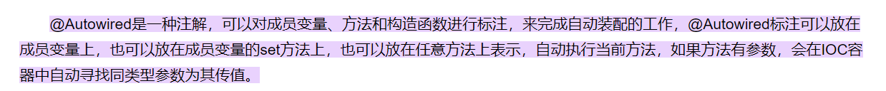

# Spring Framework

## I. Getting started with Spring Boot

### 1.1 Introduction to Spring

**Spring Framework**

- Providing comprehensive infrastructural
- OOP Best practices built in
- DRY(Don't Repeat Yourself) Principles

**Definitions**

- **POJO** - Plain old Java Object
  - any class file = attributes + methods (getters + setters + **sth**.)  !!!不只是getter 和setter
- **Java Beans** - Simple objects with only getters and setters
- **Spring Beans** - POJOs configured in the application context.

- **DTOs** (Data Transfer Objects) - state transfer of logical layer

**Inversion of Control (IoC)**

- provides mechanism of dependency injection
- Application Context wraps the Bean Factory
- provides auto-configuration of the Application Context


### 1.2 Introduction to Spring-boot

Spring boot Key Aspects

- Embedded tomcat (or others)
- Auto-configuration of Application Context
- Automatic Servlet Mappings
- Database support and Hibernate / JPA dialect
- Automatic Controller Mappings


### 1.3 Creating a Spring Boot Project

1. 登录 https://start.spring.io，完成相关配置。


2. 点击GENERATE，下载文件。
3. 将下载好的文件，移动到任意文件夹。
4. 进入项目文件夹`spring-boot-spring`，`mvn package`构建项目
5. 运行spring-boot 项目：`java -jar target/spring-boot-learning-0.0.1-SNAPSHOT.jar` 

6. 验证：http:localhost:8080

   

### 1.4 Spring Boot Skeleton Project

| Folder                        | Name                          | Annotation                                                   |
| ----------------------------- | ----------------------------- | ------------------------------------------------------------ |
| `src/main/java/com.organize/` | SpringBootLearningApplicaiton | 类名根据配置创建<br />`@SpringBootApplication` : tell the application context, when we run this as a Spring application, to use this as the base for component scanning. |
| `src/main/resources`          | application.properties        | 配置文件                                                     |
| `src/test`                    |                               | 测试文件<br/>`@SpringBootTest` : default test of spring boot （最开始就会运行） |
| `src/test`                    | HELP.md                       | 帮助文件                                                     |
| `src/test`                    | `mvnw` / `mvnw.cmd`           | maven code 用于没有下载maven                                 |
| `src/test`                    | `pom.xml`                     | 依赖配置文件                                                 |


### 1.5 Inversion of Control 控制反转

- Container maintains your clash dependencies
- Objects injected at runtime or startup time
- An object accepts the dependencies for construction instead of constructing them

**Traditional Dependency Management**


a Main method need to create several classes at first, and config them of a lot depths.

**loC Container Management**


Main --- trigger ---> loC Container, and let loC Container to instantiation (实例化) the class.


### 1.6 Annotations

**What are Annotations**

- Native support in Java
- Metadata for your code
- Often used for compiler or runtime instructions. e.g.`@test`
- Great leverage point for pointcuts.

**Proxies**

- Beans in Bean Factory are proxied 
- Annotations drive proxies
- Annotations are easy extension points, for your own abstracts too
- Methods calling order matters. (important!!! proxy class can only called with internal method/ class local method)


## II. Data Access in Spring

### 2.1 Spring Data

**What is Spring Data?**

- Provides a common set of interfaces, based on JPA
- Provides a common ***naming convention （命名规范）***  
- Provides expected behavior
- Provides Repository and Data Mapping convention(数据映射规范)

**Benefits of Spring Data**

- Remove boilerplate code (模板代码)
- Allows for swapping data sources easier. (from ***POC= proof of concept 概念验证*** to production data)
- Allows to focus on business logic

**Key Components**

- ***Repository Interface*** = *an interface that leverages proxies to build the actual base CRUD methods.*
- ***Entity Object*** = the DTO for the data layer
- ***Data Source*** = auto trigger by Spring


### 2.2 Using an Embedded Database

```
|---learning-spring
	|---bin
 		|---data.sql
    	|---shcema.sql
 	|---src
 		|---main
 			|---java
 				|---com.xxx...
 					|---Application
 			|---resources
 		|---test
```


1. Create sql

   bin -- set `sql` files and `start_postgres.sh`.

2. Add pom dependencies

   Add `jpa`  and `h2database` , version need not to be specify, because the parent pom will take care of it.

   ```xml
   <dependencies>
       <dependency>
           <groupId>org.springframework.boot</groupId>
           <artifactId>spring-boot-starter-web</artifactId>
       </dependency>
    
       <-->Add two new dependencies </-->   
       <dependency>
           <groupId>org.springframework.boot</groupId>
           <artifactId>spring-boot-starter-data-jpa</artifactId>
       </dependency>
       <dependency>			
           <groupId>com.h2database</groupId>
           <artifactId>h2</artifactId>
       </dependency>
       ...
   </dependenciestyou
   ```

3. Run maven command, to install dependencies.

4. Add info to application.properties

   ```properties
   logging.level.org.springframework.jdbc.datasource.init.ScriptUtils=debug
   spring.jpa.hibernate.ddl-auto=none
   ```

   - line 1: set log to debug level
   - line 2: avoid hibernate auto clean the schema and data we generate by hand , and auto generate a new schema to take control of it.

    

### 2.3 Spring Data Repositories

1. Create new directory data : `src/main/java/com/frankmoley/lil/learningspring/data`

2. Create new class : Room

   ```java
   package com.frankmoley.lil.learningspring.data;
   
   import javax.persistence.*;
   
   @Entity
   @Table(name="ROOM")
   public class Room {
       @Id
       @GeneratedValue(strategy = GenerationType.AUTO)
       @Column(name = "ROOM_ID")
       private long id;
       @Column(name = "NAME")
       private String name;
       @Column(name = "ROOM_NUMBER")
       private String roomNumber;
       @Column(name = "BED_INFO")
       private String bedINfo;
       
       // getters and setters
       
       // override toString
   }
   ```
   
   - `@Table(name="")`: Define table name based on the schema.
   - `GeneratedValue(strategy = GenerationType.AUTO)` : default strategy.

**Reference SQL**

 ```sql
 CREATE TABLE ROOM(
     ROOM_ID BIGSERIAL PRIMARY KEY,
     NAME VARCHAR(16) NOT NULL,
     ROOM_NUMBER CHAR(2) NOT NULL UNIQUE,
     BED_INFO CHAR(2) NOT NULL
   );
 ```

3.  `RoomRepository` Interface:

   > `src/main/.../data/RoomRepository`
   
   ```java
   package com.frankmoley.lil.learningspring.data;
   
   import org.springframework.data.repository.CrudRepository;
   import org.springframework.stereotype.Repository;
   
   @Repository
   public interface RoomRepository extends CrudRepository<Room, Long> {
   }
   ```
   
   - `extends CrudRepository<Room, Long>` : takes entity type, and id type.
   - `@Repository` : not necessary, and already on the `CrudRepository`, but help read.

3. `AppStartupEvent` Class:  

   > `src/main/.../util/AppStartupEvent`

   ```java
   @Component
   public class AppStartupEvent implements ApplicationListener<ApplicationReadyEvent> {
       private final RoomRepository roomRepository;		// 创建一个借口
   
       public AppStartupEvent(RoomRepository roomRepository) {
           this.roomRepository = roomRepository;			// 补充构造器部分。
       }
       
       @Override
       public void onApplicationEvent(ApplicationReadyEvent event) {
           Iterable<Room> rooms = this.roomRepository.findAll();	// 调用repository自动生																  // 成的方法
           rooms.forEach(System.out::println);
       }
   }
   ```

   - `@Component` : can be trigger by Spring framwork.
   - `implements ApplicationListener<ApplicationReadyEvent>`:  run after spring boot finished building, and before query.
   - `findAll()`: 自动生成的方法。


### 2.4 Using a remote database

1. Fix `pom.xml`

   ```java
   <dependency>
       <groupId>org.postgresql</groupId>
       <artifactId>postgresql</artifactId>
   </dependency>
   ```

2. `application.properties`

   ```properties
   spring.jpa.database=postgresql
   spring.datasource.url=jdbc::postgresql://localhost::5432/dev
   spring.datasource.username=postgres
   spring.datasource.password=postgres
   ```

   - username and password is not safe here.

3. Run the local server.

4. Run Application.


### 2.5 Build an additional repository

##### **Get a local DB**

1. open docker

2. get `postgresql` docker image

   ```docker
   docker pull postgres
   ```

3. build a docker-compose file

   > check the [guide](https://towardsdatascience.com/how-to-run-postgresql-using-docker-15bf87b452d4)

   ```dockerfile
   version: '3.1'
   
   services:
     db:
       container_name: pg_database		
       image: postgres:latest
       restart: always
       environment:
         POSTGRES_DB: dev
         POSTGRES_USER: postgre
         POSTGRES_PASSWORD: postgre
       volumes:
         - C:/Users/I528407/Desktop/test/infile:/infile
         - pg_data:/var/lib/postgresql/data
       ports:
         - 5432:5432
   volumes:
     pg_data:
   ```

   - `container_name`: name of container.
   - `image`: name of docker image, `<image-name> :tag`
   - `environment`: set parameters of database.
   - `volumes`: mounted a file in host machine to docker machine

   > For example, here I mounted test/infile to infile in docker. Then all the file in test/infile, is shared to infile in docker. and I can use to load data to database in next session.

4. run docker container

   > can use InteliJ to help run docker

   ```powershell
   docker-compose up -d 
   ```

5. check status

   ```powershell
   docker-compose logs -f 
   docker containers ls
   ```

##### **Add data to DB**

1. prepare SQL-dump file.

   path: `C:\Users\I528407\Desktop\test\infile` , has 2 `sql` files in the directory.
   
   **`schema.sql`**
   
   ```sql
   -- schema.sql
   CREATE TABLE ROOM(
     ROOM_ID BIGSERIAL PRIMARY KEY,
     NAME VARCHAR(16) NOT NULL,
     ROOM_NUMBER CHAR(2) NOT NULL UNIQUE,
     BED_INFO CHAR(2) NOT NULL
   );
   
   CREATE TABLE GUEST(
     GUEST_ID BIGSERIAL PRIMARY KEY,
     FIRST_NAME VARCHAR(64),
     LAST_NAME VARCHAR(64),
     EMAIL_ADDRESS VARCHAR(64),
     ADDRESS VARCHAR(64),
     COUNTRY VARCHAR(32),
     STATE VARCHAR(12),
     PHONE_NUMBER VARCHAR(24)
   );
   
   CREATE TABLE RESERVATION(
     RESERVATION_ID BIGSERIAL PRIMARY KEY,
     ROOM_ID BIGINT NOT NULL,
     GUEST_ID BIGINT NOT NULL,
     RES_DATE DATE
   );
   
   ALTER TABLE RESERVATION ADD FOREIGN KEY (ROOM_ID) REFERENCES ROOM(ROOM_ID);
   ALTER TABLE RESERVATION ADD FOREIGN KEY (GUEST_ID) REFERENCES GUEST(GUEST_ID);
   CREATE INDEX IDX_RES_DATE_ ON RESERVATION(RES_DATE);
   ```
   
   **`data.sql`**
   
   ```sql
   INSERT INTO ROOM (NAME, ROOM_NUMBER, BED_INFO) VALUES ('Piccadilly', 'P1', '1Q');
   -- ...
   
   INSERT INTO GUEST (LAST_NAME, FIRST_NAME, EMAIL_ADDRESS, COUNTRY, ADDRESS, STATE, PHONE_NUMBER) VALUES('Adams', 'Roy', 'radams1v@xinhuanet.com', 'United States', '2872 Marquette Street', 'NY', '1-(235)314-9823');
   -- ...
   
   INSERT INTO RESERVATION (ROOM_ID, GUEST_ID, RES_DATE) VALUES ((SELECT ROOM_ID FROM ROOM WHERE ROOM_NUMBER = 'C2'), (SELECT GUEST_ID FROM GUEST WHERE LAST_NAME = 'Young'), '2022-01-01');
   
   -- ...
   ```
   
1. open the `postgresql `container

   ```cmd
   docker exec -it pg_database bash
   ```

3. load data into db.

   ```powshell
    psql --host=pg_database --dbname=dev --username=postgre -f infile/schema.sh
   ```

   - `--hos`t : name of docker container
   - `--dbname`: name of database, set in environment param
   - `--username`: name of user
   - `-f`: SQL-dump file.

   or shorter way.

    ```powershell
    psql -h pg_database -d dev -U postgre -f infile/schema.sql
    psql -h pg_database -d dev -U postgre -f infile/data.sql
    ```

   

   

4. login db

   ```java
   psql -h pg_database -d dev -U postgre
   ```

5. check table

   ```powershell
   \dt
   ```

   

##### **Link to Spring-boot**

1. set `pom.xml`

   ```xml
   <?xml version="1.0" encoding="UTF-8"?>
   <project xmlns="http://maven.apache.org/POM/4.0.0" xmlns:xsi="http://www.w3.org/2001/XMLSchema-instance"
   	xsi:schemaLocation="http://maven.apache.org/POM/4.0.0 https://maven.apache.org/xsd/maven-4.0.0.xsd">
   	<modelVersion>4.0.0</modelVersion>
   	<parent>
   		<groupId>org.springframework.boot</groupId>
   		<artifactId>spring-boot-starter-parent</artifactId>
   		<version>2.7.3</version>
   		<relativePath/> <!-- lookup parent from repository -->
   	</parent>
   	<groupId>com.cetacean</groupId>
   	<artifactId>spring-boot-learning</artifactId>
   	<version>0.0.1-SNAPSHOT</version>
   	<name>spring-boot-learning</name>
   	<description>Demo project for Spring Boot</description>
   	<properties>
   		<java.version>17</java.version>
   	</properties>
   	<dependencies>
   		<dependency>
   			<groupId>org.springframework.boot</groupId>
   			<artifactId>spring-boot-starter-web</artifactId>
   		</dependency>
   		<dependency>
   			<groupId>org.springframework.boot</groupId>
   			<artifactId>spring-boot-starter-data-jpa</artifactId>
   		</dependency>
   		<dependency>
   			<groupId>org.postgresql</groupId>
   			<artifactId>postgresql</artifactId>
   		</dependency>
   		<dependency>
   			<groupId>org.springframework.boot</groupId>
   			<artifactId>spring-boot-starter-test</artifactId>
   			<scope>test</scope>
   		</dependency>
   	</dependencies>
   
   	<build>
   		<plugins>
   			<plugin>
   				<groupId>org.springframework.boot</groupId>
   				<artifactId>spring-boot-maven-plugin</artifactId>
   			</plugin>
   		</plugins>
   	</build>
   
   </project>
   ```

   

2. set `application.properties`

   ```properties
   logging.level.org.springframework.jdbc.datasource.init.ScriptUtils=debug
   spring.jpa.hibernate.ddl-auto=none
   
   spring.jpa.database=postgresql
   spring.datasource.url=jdbc:postgresql://localhost:5432/dev
   spring.datasource.username=postgre
   spring.datasource.password=postgre
   ```

   - `url` = `jdbc:postgresql://localhost:<port>/<database-name>`

3. set data entity and data repository

   **data entity**

   ```java
   @Entity
   @Table(name = "RESERVATION")
   public class Reservation {
       // 1. attributes
       @Id
       @Column(name = "RESERVATION_ID")
       private long reservationId;
       @Column(name = "ROOM_ID")
       private long roomId;
       // .... other attributes
   
   	// 2. getter and setters
       
       // 3. toString
   }
   ```

   ##### **data repository**

   ```java
   import java.sql.Date;
   
   @Repository
   public interface ReservationRepository extends JpaRepository<Reservation,Long> {
       Iterable<Reservation> findReservationByEReservationDate(Date date);
   }
   ```

   - Add a new method on Reservation Entity, so you can add a method in the data repository. Keep the way to name the method.
   - Notice to import `java.sql.Date` not `util` one ,as we are writing a sql.

4. component listener to test the function

   ```java
   @Component
   public class ApplicationStartupEvent implements ApplicationListener<ApplicationStartedEvent> {
       private RoomRepository roomRepository;
       private GuestRepository guestRepository;
       private ReservationRepository reservationRepository;
   
       public ApplicationStartupEvent(RoomRepository roomRepository, GuestRepository guestRepository, ReservationRepository reservationRepository) {
           this.roomRepository = roomRepository;
           this.guestRepository = guestRepository;
           this.reservationRepository = reservationRepository;
       }
   
       @Override
       public void onApplicationEvent(ApplicationStartedEvent event) {
   //        Iterable<Guest> guests = guestRepository.findAll();
   //        guests.forEach(System.out::println);
           Iterable<Reservation> res = reservationRepository.findAll();
           res.forEach(System.out::println);
   
       }
   }
   ```


## III. Service Tier

### 3.1 Utilizing IoC

**Why use loC**

- Allows you to focus on contracts.
- Develop business code only, leave construction to the container.
- Build intermediate abstractions. 建立中间抽象。
- Produce clean code.

**Spring and loC**

- loC container is configured by developer. e.g. Component Scanning, XMLConfig, JavaConfig
- Spring maintains handles to objects constructed at startup
  - Spring scan every bean that will be configured, and creates an initialization, and handle to initialization in BeanFactory itself.
  - Spring build the order beans must be constructed.
  - Multi-step process to construct the objects themselves.

- Spring serves singletons to classes during construction
- Spring maintains lifecycle of beans
- Developer only accesses the application context


### 3.2 Build a service abstraction

**Why build Service Abstractions**

- Encapsulate layers

  > view layer (视图层) --- service abstractions: build business logic (服务层) --- data layer (数据层)

- Abstract 3rd Party APIs

  > Isolated the impacted code if something does change.

- Simplify implementations
- Swap out implementations as runtime

**How to build one** 

- Define our interface (or class)
- Create the API
- Inject the dependencies
- Annotate or configure
- Code the implementation


### 3.3 Develop a service object

```
...
|--business
	|-- ReservationService
	|-- RoomReservation				// DTO combines three entities
...
```

We need to annotate classes with stereotype (such as `@Component`) to let Spring Framework to recognize the class.

```java
// Step 1: add @Service
@Service
public class ReservationService {
    
// Step 2: make parameters final
    private final RoomRepository roomRepository;
    private final GuestRepository guestRepository;
    private final ReservationRepository reservationRepository;
    
// Step 3: add a simple constructure.
    public ReservationService(RoomRepository roomRepository, GuestRepository guestRepository, ReservationRepository reservationRepository) {
        this.roomRepository = roomRepository;
        this.guestRepository = guestRepository;
        this.reservationRepository = reservationRepository;
    }

    public List<RoomReservation> getRoomReservationsForDate(Date date) {
```

- `@Service` : write abstract oriented programming that responds to service and vocations.

- Make all the parameters final, because its singleton and don't want them to be changed.
- Add a simple constructer.


**Why not add `@Autowired` to constructer?** 



- Java Class will set a default constructor / use the first constructer as the default constructor.
- When get 2 constructors, the first one should get `autowired`.


## IV. Web Pages with Spring

### 4.1  Controller

**Model View Control —— MVC Pattern**

- Fundamental pattern for web application development.
- Model is the data.
- View is the visual display that is populated.
- Controller wires the view with the model.

**Spring Controller**

- Spring bean
- Annotated for the servlet mapping
- Responds to incoming web requests
- Outputs a view or raw data


### 4.2 Build a Controller

```java
@Controller
@RequestMapping("/reservations")
public class RoomReservationController {
    private final DateUtils dateUtils;
    private final ReservationService reservationService;

    public RoomReservationController(DateUtils dateUtils, ReservationService reservationService) {
        this.dateUtils = dateUtils;
        this.reservationService = reservationService;
    }

    @RequestMapping(method = RequestMethod.GET)
    public String getReservations(@RequestParam(value = "date", required = false) String dateString, Model model){
        Date date = this.dateUtils.createDateFromDateString(dateString);
        List<RoomReservation> roomReservations = this.reservationService.getRoomReservationsForDate(date);
        model.addAttribute("roomReservations",roomReservations);
        return "roomres";
    }
}
```

- Model Class: 用于返回的数据.
- `@Controller`: It provides web mapping to a URL.
- `RequestMapping`: 
- `@RequestParam(value = "date",required = false)`
- `return "roomres"`: a template of thymeleaf, in resources/templates.


### 4.3 Using Thymeleaf

1. Add dependency

   ```xml
   <dependency>
       <groupId>org.springframework.boot</groupId>
       <artifactId>spring-boot-starter-thymeleaf</artifactId>
   </dependency>
   ```

2. Add a statistic page

   ```html
   <!DOCTYPE html>
   <html lang="en" xmlns:th="http://www.thymeleaf.org">
   <head>
       <meta charset="UTF-8">
       <title>Landon Hotel: Room Reservations</title>
   </head>
   <body>
   <h1>Welcome to the Reservations Page</h1>
   <table>
       <tr>
           <td>Room</td>
           <td>Room Number</td>
           <td>Guest</td>
       </tr>
       <tr th:each="roomReservation: ${roomReservations}">
           <td th:text="${roomReservation.roomName}">Room Name</td>
           <td th:text="${roomReservation.roomNumber}">Room Number</td>
           <td th:text="${roomReservation.lastName}!=null? ${roomReservation.lastName} + ', ' +
           ${roomReservation.firstName}: 'VACANT'">Guest</td>
       </tr>
   </table>
   
   </body>
   </html>
   ```

   

## V. Exposing RESTful Endpoints

### 5.1 RestController

- Spring uses controllers for RESTful webservices.
- Just another MVC, only our view is JSON.
- Once you understand the paradigm, its straight forward.
- Spring marshals JSON for you.
- You can configure XML if desired.


### 5.2 Expose a service layer  through REST

```java
@RestController
@RequestMapping("/api")
public class WebserviceController {
    private final DateUtils dateUtils;
    private final ReservationService reservationService;

    public WebserviceController(DateUtils dateUtils, ReservationService reservationService) {
        this.dateUtils = dateUtils;
        this.reservationService = reservationService;
    }
    @RequestMapping(path = "/reservations", method = RequestMethod.GET)
    public List<RoomReservation> getReservation(@RequestParam(value = "date", required = false) String dateString){
        Date date = this.dateUtils.createDateFromDateString(dateString);
        return this.reservationService.getRoomReservationsForDate(date);
    }
}
```

- `@RestController`
  - Tell Spring to put an app response body on each of our methods. 
  - Response body will take the data object that we return converted into a JSON payload.
  - Return that JSON payload out through our web interface.
- `@RequestMapping("/api")` Give an url.
- `@RequestMapping(path = "/reservations", method = RequestMethod.GET)` 
  - Set address and method.
- `@RequestParam(value = "date", required = false)` .
  - value: alias name of the parameter pass from the view. (接受前端变量的名字)
  - 使得后端可以给参数自定义的名字。
  - required = false: 当传入参数为空时，可以利用自定义方法生成当前时间。


### 5.3 Challenge: RESTful endpoints

> Requirements:
>
> 1. Expose a service that lists our guests and allows one to be added at /api/guests
> 2. Expose a service that lists our rooms at `/api/rooms`
> 3. Wire them through our `ReservationService`

1. Add RESTful controller to `WebserviceControll Class` in **Controller Tier**.

```java
@RequestMapping(path = "/guest", method = RequestMethod.GET)
public List<Guest> getGuests(){
    return this.reservationService.getHotelGuests();
}

@PostMapping(path = "/guest")
@ResponseStatus(HttpStatus.CREATED)
public void addGuest(@RequestBody Guest guest){
    this.reservationService.addGuest(guest);
}

@GetMapping(path = "rooms")
public List<Room> getRooms() {return this.reservationService.getRooms();}
```

- `@PostMapping(path = "/guest")` == `@RequestMapping(path = "/guest", method = RequestMethod.POST)`
- `@ResponseStatus(HttpStatus.CREATED)` : return a response.
- `@RequestBody`: pass a query body.

2.  Add methods to `ReservationService Class` in **Service Tier**.

```java
public List<Guest> getHotelGuests(){
    Iterable<Guest> guests = this.guestRepository.findAll();
    List<Guest> guestList = new ArrayList<>();
    guests.forEach(guest->{guestList.add(guest);});
    guestList.sort(new Comparator<Guest>() {
        @Override
        public int compare(Guest o1, Guest o2) {
            if (o1.getLastName().equals(o2.getLastName())){
                return o1.getFirstName().compareTo(o2.getFirstName());
            }
            return o1.getLastName().compareTo(o2.getLastName());
        }
    });
    return guestList;
}

public void addGuest(Guest guest){
    if (null == guest){
        throw new RuntimeException("Guest cannot be null");
    }
    this.guestRepository.save(guest);
}

public List<Room> getRooms(){
    Iterable<Room> rooms = this.roomRepository.findAll();
    List<Room> roomList = new ArrayList<>();
    rooms.forEach(room -> {roomList.add(room);});
    roomList.sort(new Comparator<Room>() {
        @Override
        public int compare(Room o1, Room o2) {
            return o1.getRoomNumber().compareTo(o2.getRoomNumber());
        }
    });
    return roomList;
}
```

- `guestRepository.save(guest)`: Add a data.
- `throw ClientException` in reality.

3. Fix id in Table in **Data Tier**.

```java
@Id
@Column(name="GUEST_ID")
@GeneratedValue(strategy = GenerationType.IDENTITY)
private long guestId;
```

