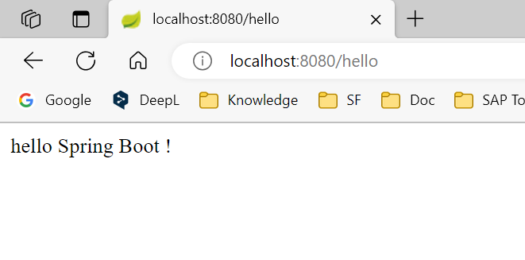
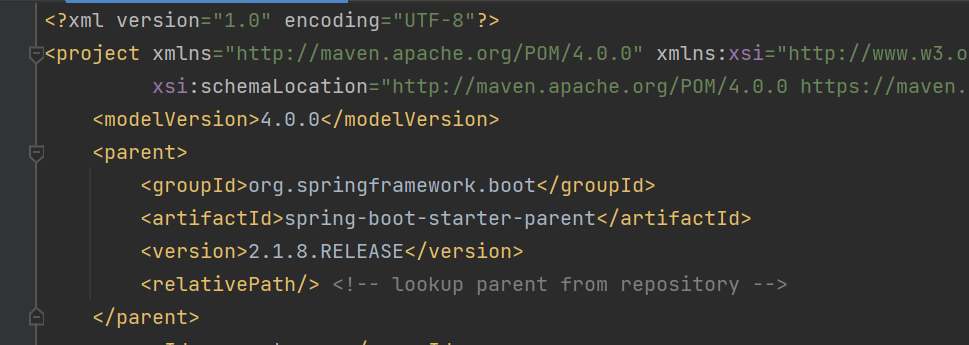
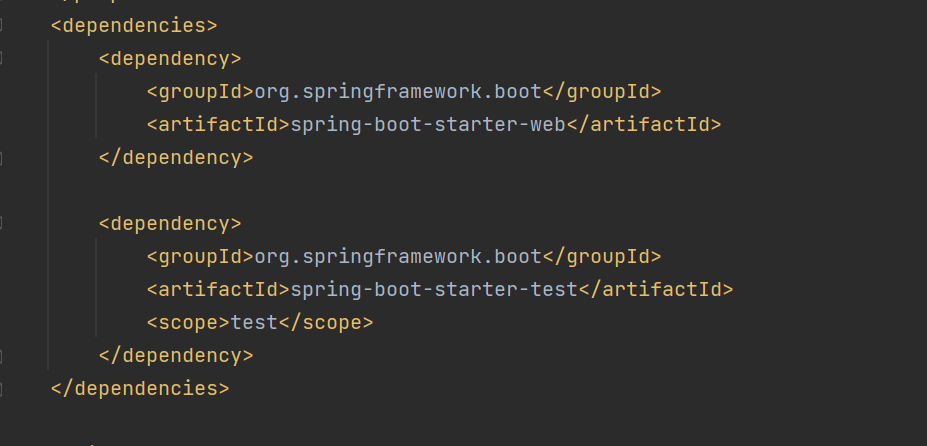
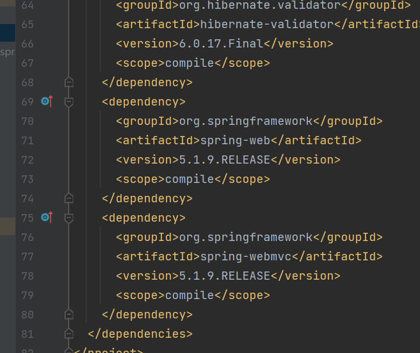

# Spring Boot

[笔记参考 视频资料](https://www.bilibili.com/video/BV1Lq4y1J77x/?p=5&spm_id_from=333.1007.top_right_bar_window_history.content.click)

## 1. SpringBoot 概述

Spring boot 简化了Spring 的配置方式，基于约定由于配置的思想。提供了快速使用Spring项目的方式。

#### Spring 缺点

- 配置繁琐
- 依赖繁琐

#### SpringBoot 功能

1. ==自动配置==
2. ==起步依赖== ---- 传递依赖
3. 辅助功能 （嵌入式服务器，安全，指标...)


## 2. Springboot 快速入门

> 使用案例快速入门
>
> 官网构建Springboot文档：[这里](https://docs.spring.io/spring-boot/docs/current/reference/html/getting-started.html#getting-started.installing.java.maven)

### 2.1 hello world工程

案例需求

- 搭建SpringBoot工程，定义HelloController.hello()方法，返回Hello SpringBoot。

案例实现

1. 创建Maven项目

2. 导入SpringBoot起步依赖

   pom.xml

   ```xml
   <?xml version="1.0" encoding="UTF-8" standalone="no"?>
   <project xmlns="http://maven.apache.org/POM/4.0.0" xmlns:xsi="http://www.w3.org/2001/XMLSchema-instance" xsi:schemaLocation="http://maven.apache.org/POM/4.0.0 http://maven.apache.org/xsd/maven-4.0.0.xsd">
     <modelVersion>4.0.0</modelVersion>
     <groupId>org.cetacean</groupId>
     <artifactId>springboot-helloworld</artifactId>
     <version>1.0-SNAPSHOT</version>
   
     <!-- Inherit defaults from Spring Boot 需要继承的父工程 -->
     <parent>
       <groupId>org.springframework.boot</groupId>
       <artifactId>spring-boot-starter-parent</artifactId>
       <version>2.1.8.RELEASE</version>
     </parent>
   
     <!--    Web 开发的启动依赖-->
     <dependencies>
       <dependency>
         <groupId>org.springframework.boot</groupId>
         <artifactId>spring-boot-starter-web</artifactId>
       </dependency>
     </dependencies>
   
   </project>
   
   ```

3. 定义Controller

   ```java
   // src.java.com.demo.controller
   
   package com.demo.controller;
   
   import org.springframework.web.bind.annotation.RequestMapping;
   import org.springframework.web.bind.annotation.RestController;
   
   @RestController
   public class HelloController {
   
           @RequestMapping("/hello")
       public String hello(){
           return "hello Spring Boot !";
       }
   }
   ```

   

4. 编写引导类

   ```java
   package com.demo;
   
   import org.springframework.boot.SpringApplication;
   import org.springframework.boot.autoconfigure.SpringBootApplication;
   
   /*
   * 引导类 SpringBoot入口*/
   @SpringBootApplication
   public class HelloApplication {
       public static void main(String[] args) {
           SpringApplication.run(HelloApplication.class,args);
       }
   }
   
   ```

   

5. 启动测试

- 运行引导类

- 打开浏览器，输入网址`http://localhost:8080/hello`

- 显示如下

  

#### 小结

- 创建项目时，使用jar的打包方式
- 引导类是项目入口，运行main方法启动项目。
- SpringBoot和Spring项目，业务代码编写方式一致。


### 2.2 Idea 模板构建项目

案例需求

- 使用Idea快速构建SpringBoot工程。
- 定义HelloController.hello()方法，返回Hello SpringBoot。

案例实现

方法一：  Idea中直接构建

`New Module` --- `Spring Initializer` 

- `Next` ---- 修改 `Group + Artifact + Type + Language ....` + `Next` --- `Choose Dependencies `

方法二：spring.io官网上构建


## 3. SpringBoot 起步依赖原理分析

### 起步依赖原理分析

1. spring-boot-starter-parent

   - 定义了版本的信息。
   - 点击`spring-boot-starter-parent`跳转至pom文件的顶层父类文件。（中间有两层，`spring-boot-dependencies-2.1.8.RELEASE.pom`)

   

   - 顶层父类文件包含：properties + propertyManagement
     - 主要作用是用于定义互相不冲突的常用的依赖版本。如果在pom.xml中定义了新的依赖，且依赖在父类文件中已经定义版本，则可以不添加版本使用自带的版本。（==避免版本冲突==）
     - 例：没有指定版本号，已经在父类中指定了。

   

2. spring-boot-starter-web

   - 依赖`spring-web`, `spring-webmvc`两个依赖。（依赖传递）
   - 

#### 小结

- starter中，定义了完成该功能需要的坐标合集（依赖版本），其中大部分版本信息源于父工程。
- 新工程继承parent, 引入stater之后，通过依赖传递，方便使用jar包，且不会存在版本冲突问题。


## 4. SpringBoot  配置

### 4.1 配置文件分类

配置文件分类

- application.properites

  ```properties
  server.port=8080
  ```

- application.yaml / application.yml

  ```yaml
  server:
    port: 8080
  ```


### 4.2 yaml

### 4.3 读取配置文件内容

### 4.4 profile

### 4.5 内部配置加载顺序

### 4.6 外部配置加载顺序

