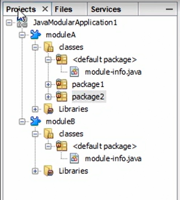

# Advanced in Java

## I. Generics in Java 泛型

### 1.1 Intro of Generics

Generics is a way to tell compiler what kind of object(对象) a collection can contain.

- Compiler 可以检测数据类型，更安全
- 不需要对Object 进行 类型cast

```java
// Example without Generics
    List names = new ArrayList();
    names.add("Kelly");        
    String name = (String) names.get(0); 	// 2. need to cast type 
    System.out.println("First name: " + name);
	names.add(7);		// 1. int type can be add to ArrayList
```

```java
// Example with Generics
    List<String> names2 = new ArrayList();
    names2.add("Kelly");        
    String name2 = names2.get(0);			// 2. do not need cast type
    System.out.println("First name: " + name2);
    names2.add(7);		// 1. can only add String type to List
```


### 1.2 Generic Methods

- Specify the type of the parameter, can get compiler run time error.
- Compared to Generic methods, using Objects instead is not safe.

Use Object Type.

```java
public class GenericMethods {

    static Character[] charArray = {'h', 'e', 'l', 'l', 'o'};
    static Integer[] intArray = {1, 2, 3, 4, 5};
    static Boolean[] boolArray = {true, false, true};
	
    // 使用Object父类，去接收参数
    public static List arrayToList(Object[] array, List<Object> list) {
        for (Object object : array) {
            list.add(object);
        }
        return list;
    }

    public static void main(String[] args) {
        List<Character> charList = arrayToList(charArray, new ArrayList<>());
        List<Boolean> boolList = arrayToList(boolArray, new ArrayList<>());
        List<Integer> intList = arrayToList(intArray, new ArrayList<>());
        // 即使类型不一致，使用Object的情况，也不会产生compiler runtime error.
        List<String> intList = arrayToList(intArray, new ArrayList<>());
    }

}
```

Use Generic Methods

```java
public class GenericMethods {

    static Character[] charArray = {'h', 'e', 'l', 'l', 'o'};
    static Integer[] intArray = {1, 2, 3, 4, 5};
    static Boolean[] boolArray = {true, false, true};

    // 使用泛型。 注意泛型的写法。指定类型一致，对于不一致的情况，会产生运行时错误。
    public static <T> List<T> arrayToList(T[] array, List<T> list) {
        for (T object : array) {
            list.add(object);
        }
        return list;
    }

    public static void main(String[] args) {
        List<Character> charList = arrayToList(charArray, new ArrayList<>());
        List<Boolean> boolList = arrayToList(boolArray, new ArrayList<>());
        List<Integer> intList = arrayToList(intArray, new ArrayList<>());
        System.out.println(intList.get(0));
    }

}
```


### 1.3 Varargs

Varargs, means variable-length arguments.  

- Varargs can put all arguments in an array for developer.
- Gramma: `String...`

```java
private static void printShoppingList(String... items){
    System.out.println("SHOPPING LIST");
    for (int i =0; i< items.length; i++){
        System.out.println(i + 1 + ": " + items[i]);
    }
    System.out.println();
}
```


### 1.4 Liskov Subsitution principle

**Liskov Subsitution principle**:

- If you have a variable of a given type, you can assign it to a value that is a subtype of that type. 
- But it won't work with List type.
- （如果函数可以接受一个父类参数，就可以接受它的子类参数，但对于列表不适用）

```java
// Building 父类，Office 子类； 两个类仅覆写了toString方法。 
public static void main(String[] args) {
        Building building = new Building();        
        Office office = new Office();
        build(building);	// 会输出building
        build(office);		// 会输出office
        
        static void build(Building building) {
        System.out.println("Constructing a new " + building.toString());
    }
    
    	// Building 类型的List，会正常输出
        List<Building> buildings = new ArrayList();
        buildings.add(new Building());
        buildings.add(new Office());
        printBuildings(buildings);
        
    	// Office 类型的List，不能被printBuildings接受。因为该原则对列表不适用。
        List<Office> offices = new ArrayList();
        offices.add(new Office());
        offices.add(new Office());
        printBuildings(offices);
        
    }
    
    
    static void printBuildings(List<Building> buildings) {
        for(int i = 0; i < buildings.size(); i++) {
            System.out.println(i + 1 + ": " + buildings.get(i).toString());
        }
}
```


### 1.5 Wildcards in generic programming

Wildcards support to pass a certain type of arguments to a method.

- Support wildcards in two types: extends and super
- Use extends: invariable , the argument is an source data to the method.
- Use `super`: outvariable, the arguments are additional input to the method.

```java
    public static void main(String[] args) {
        
        // List of buildings
        List<Building> buildings = new ArrayList();
        buildings.add(new Building());
        buildings.add(new Building());
        printBuildings(buildings);
        
        // List of offices
        List<Office> offices = new ArrayList();
		// ...
        printBuildings(offices);

        // List of houses
        List<House> houses = new ArrayList();
		// ...
        printBuildings(houses);
        
        addHouseToList(houses);
        addHouseToList(buildings);        
        
    }

	// 1. 可以接受所有building的子类型    
    static void printBuildings(List<? extends Building> buildings) {
        for(int i = 0; i < buildings.size(); i++) {
            System.out.println(buildings.get(i).toString() + " " + (i + 1));
        }
        System.out.println();
    }
    
    // 2. 可以接受House以及它的父类型
    static void addHouseToList(List<? super House> buildings) {
        buildings.add(new House());
        System.out.println();
    }
}
```


## II. Advanced Data Structures

### 2.1 Collection Framework

Collections enable you to get objects together in a container, which you can iterate over.

**Key factors to choose a collection**

- **Order**: Is order important?
- **Duplicated**: Are duplicated allowed?
- **Speed**: How fast it will be to perform operations?

**Layer of Collections**


- Collection implement Iterable. It declares the `forEach` method.
- Collection interface declares all the methods that every collection must have. `add`, `remove`, `isempty`...

- 在具体实现类前一层，还有Set, List, Queue ...

​		**Sets**:  No duplicated, Unordered

​		**Lists**:  Allow duplicated, Ordered

​		**Queues**:  FIFO

​		**MAP**:  Does not extend Collection interface, Key-value pair

### 2.2 LinkedList

1. Quick in Insert, removing elements
2. Take more memory,读取某个位置的元素速率慢。

```java
LinkedList<String> myList = new LinkedList();
myList.add("a");
myList.add("b");
myList.add(1,"c");	// 在a后添加c 
System.out.println(myList); // acb
myList.remove("b"); // a, c
```


### 2.3 Queue

1. Can you LinkedList to achieve it.

```java
LinkedList<T> queue = new LinkedList();
queue.add("A"); // 入队
queue.add("B");
a = queue.poll; // 出队， 如果出队的元素是一个Class，可以调用它自身方法。
```


### 2.4 HashMap

1. Element not in order.
2. Key should be unique. **IF add ONE KEY with two value, only the last will be saved.**
3. Null can be key.
4. Check / Delete element by key.
5. Clear all elements

```java
HashMap<String,Integer> phonebook = new HashMap<>();
phonebook.add("name1",123456);
phonebook.add("samename",234567);
phonebook.add("samename",456789); 	// only save "samename":456789
phonebook.add(null,1234567);		// null can be key
if(phonebook.containsKey("samename")){
    phonebook.remove("samename");	// remove an element by key
}
phonebook.clear()					// clean all elements
```


### 2.5 LinkedHashMap

1. Element in order.

2. Available to specify the retrieve order : by alter the constructor.

   1. by added in order
   2. by accessed order

3. `LinkedHashMap( int initialCapacity, float loadFactor,boolean accessOrder)`

   1. **initialCapacity** : set initial capacity of the map.    *`default = 16`*

   2. **loadFactor** : how full the map can be, before it is made bigger.   *`default = 0.75f `*

       If `initailCapacity` = 4, then the map will get bigger when there are 3 entries in the map.

   3. **accessOrder** : which mode to retrieve entries

      1. false = added order
      2. true = access order, the lastest accessed entry will return in the last.

      > 最近处理的，最后返回。


## III. Functional Programming

> Introduce in Java 8

### 3.1 Functional Interface

***Lambda*** represents the implementation (执行) of a *functional interface (函数接口）* .

***Functional interface*** is an interface that has only one abstract method.

> 函数接口：仅有一个抽象方法的接口。

- allows Java programmers to pass code around as data.

```java
@FunctionalInterface
public interface GreetingMessage {
    public abstract void greet(String name);
}
```


### 3.2 Lambda

Lambda provides short and simple way to implement functional interface.

Without Lambda, using functional interface is long and messy.

```java
    public static void main(String[] args) {
        GreetingMessage gm = new GreetingMessage() {
            @Override
            public void greet(String name) {
                System.out.println("Hello "+name);
            }
        };
        gm.greet("cetacean");
    }
```

With Lambda, code are simple and short.

```java
    public static void main(String[] args) {
        GreetingMessage gm = (String name) -> {
            System.out.println("Hello "+name);
        };
        gm.greet("cece");
    }
```


### 3.3 Methods references

If you have a lambda expression that passes in a variable and then calls a method on that variable, you can replace it with a method reference.

> Lambda 用于省略复杂的模板结构，定制化实例方法。重点在补充实例化方法。
>
> methods references 用于单一参数（类...)，方法也封装好的，省略整体结构。故仅强调参数类型以及参数调用的函数名。

Without method refernece.

```java
    public static void main(String[] args) {

        Square s = new Square(4);		// new Square instance

        // can use method reference insteand
        Shapes shapes = (Square square) -> {	// call funtioncal interface: Shape, passing square
            return square.calculateArea();	// return Squeare function result
        };

        System.out.println("Area: " + shapes.getArea(s));

    }
```

With method refercne.

```java
    public static void main(String[] args) {

        Square s = new Square(4);

        // use method reference
        Shapes shapes = Square::calculateArea; 

        System.out.println("Area: " + shapes.getArea(s));

    }
```


### 3.4 Streams

***Streams*** provide a clean and simple way to iterate over a collection in Java. Instead of using a ***forEach loop***, streams *<u>allow functional programming techniques to be used</u>*.

**1. forEach loop** :

- Use external iteration. 
- An iterator object is created, it controls the iteration process. 
- Iterator object does execution separately, and checks the next item. It stops when it reaches the end.

> 使用迭代器，对于每一项执行操作。

```java
for (Book book : books){
    if(book.getAuthor().startsWith("J")){
        System.out.println(book.toString());
    }
}
```

  **External iteration**

- Hard to write parallel iterations
- Requires boilerplate code
- Difficult to read meaning
- Hard to abstract away from behavior

**2. Stream**

- Use internal iterator.
- Get two methods: lazy method & eager method.

```java
books.stream().filter(book ->{
    return book.getAuthor().startswith("J");})
    // more filters
    // more filters
    .forEach(System.out::println);
```

- stream() : return a Stream Object, it's an interface that contains a sequence of elements from the collection we called the method on.
- filter(): lazy method. Check the condition, if meets adds it to stream.
- forEach(): eager method. Do the action for the whole stream.

**Examples:**

Stream in Java

```java
    public static void main(String[] args) {
        
        ArrayList<Book> books = populateLibrary();
        books.stream().filter(book -> {
            return book.getAuthor().startsWith("A");
        }).filter(book -> {
            return book.getTitle().startsWith("M");
        }).forEach(System.out::println);
        
    }
```

Parallel Stream in Java

- Optimize efficiency, only when deal with *<u>huge amount of data</u>* and the machine with <u>*several cores*</u>.

```java
public static void main(String[] args) {
    
    ArrayList<Book> books = populateLibrary();
    
    // change the method name
    books.parallelstream().filter(book -> {
        return book.getAuthor().startsWith("A");
    }).forEach(System.out::println);
    
}
```


## IV. Modular Programming

> Introduced in Java 9

### 4.1 Modules

Modular system has been used to break up the JDK itself. Also, can be used for creating Java applications.

**What is a module?**

- Modules contain code, and maybe other resources.
- Modules must have unique names.
- Module contains some information describing itself.

> By default module can not be accessed from outside, even to public class.


### 4.2 Create a module

Create a  `module-info.java` file to requires other models, or export your module.

 

```java
module HelloWorld {
    
    requires java.desktop;
    exports helloworld;
    
}
```


### 4.3 Modular structure

Multi-module structure.




### 4.4 Multiple modules

Multiple modules can help you achieve encapsulation in an easy way.

For example, we have a project structure like this

```java
|--- bookingsystem
	|--- classes
    	|--- employees
    		|--- Hairdresser.java
    	|--- scheduling
    		|--- Scheduler.java
    	|--- module-info.java		// only exports scheduling
    |--- tests
|--- customer
	|--- classes
    	|--- customers
    		|--- Customer.java
    	|--- module-info.java		// imports bookingsystem, but can only use function in scheduling
    |--- tests
```

The example successfully hide the Hairdresser, even the whole module is imported by customer module.


### 4.5 Run modules from command line

Compiling and running modular from command line.

1. Create a module with a file structure like this:

   ```cmd
   |--- ModularExample
   	|--- src
       	|--- roses				// module name
       		|--- com
       			|--- cetacean
       				|--- sunny
       					|--- sayhi.java
       		|--- module-info.java		
   ```

2. Open ***command prompt*** in `Modular Example`.

3. Compile java module

   ```cmd
   javac -d output/roses src/roses/com/cetacean/sunny/sayhi.java src/roses/module-info.java
   ```

   - **`-d`** : location to place the output compiled files, the name should be the same as the compiled module.

     > In example, compiled java will be placed at `ModularExample/output`

   -  `filepath` : add path of java file needed to be compile, add path of module-info

4. Run  java module

   ```java
   java --module-path output --module roses/com.cetacean.sunny.sayhi
   ```

   - **`--module-path / -p`**:  path of the directory that contains my compiled module
   - **`--module / -m`**: name of the module
   
    ```cmd
    java - output -m roses/com.cetacean.sunny.sayhi
    ```


## V. Multithreading in Java

### 5.1 Introduction

> Multi-threading is closer than multi-processing.

- A process can have several threads working at the same time.

- A thread makes use (利用) of the CPU core inside a computer.

- Each thread has its **own stack** and **own local variables**.

- Threads **share memory** with other threads. ==> All of the threads have the same access to **global variables**.

  

**When to use Threads**

- Blocking I/O

  > User available to do things when one threads is blocked by I/O.

- GUI applications

  > To improve responsiveness of the program. e.g. use AWT / Swing.

- Independent tasks


### 5.2 Thread class

> Run thread extend Thread Class.

`ThreadExample` Class:

```java
public class ThreadExample extends Thread{
    
    @Override
    public void run{
        int i = 1;
        while(i <100){
            System.out.println(i + " " + this.getName());
            i++;
        }
    }
}
```

- Use by **extends `Thread` Class.**
- Any calls you want the thread to execute goes in the **`run` method.**
- `this.getName()` : get name of current thread.

`Main` Class:

```java
public class Main{
    public static void main(String[] args){
        System.out.println(Thread.activeCount());
        
        ThreadExample thread1 = new ThreadExample();		// new a thread and wait
        thread.setName("threadname");
        thread1.start();									// run the thread
    }
}
```

- `Thread.activeCount()`: a static method of `Thread` Class, to show how many threads are running.
- `thread.start();` Run a thread.
- `thread.setName("threadname")`: Set name for thread.


### 5.3 Runnable interface

> Run thread implements Runnable.

**Benefits than `extend Thread`**

- Available to extend other class. (In Java, one class can only extend one class.)

`RunnableExample` Class :

```java
public class RunnableExample implements Runnable {
    
    @Override
    public void run{
        int i = 1;
        while(i <100){
            System.out.println(i + " " + Thread.currentThread().getName);
            i++;
        }
    }
}
```

- Use by implements Runnable.
- `Thread.currentThread().getName()` : get name of current thread.

`Main` Class:

```java
public class Main {
    public static void main(String[] args) {
        // 1. create a thread with implemented class RunnableExample 
        Thread thread1 = new Thread(new RunnableExample());
        thread1.start();

        // 2. create a thread with Runnable and override
        Thread thread2 = new Thread(new Runnable() {
            @Override
            public void run() {
                int i = 6;
                while (i <= 10) {
                    System.out.println(i++ + " " + Thread.currentThread().getName());
                }
            }
        });
        thread2.start();

        // 2. create a thread with Runnable and override and lambda
        Thread thread3 = new Thread(() -> {
            int i = 6;
            while (i <= 10) {
                System.out.println(i++ + " " + Thread.currentThread().getName());
            }
        });
        thread3.start();
    }
}
```

- Create by constructor of Thread, which takes a runnable as an argument.


### 5.4 Synchronized methods

- Allow only one thread enter the method at a time.
- Add `synchronized` to method signature.

> 解决多线程同时使用一个方法造成的冲突，例：脏读。

```java
static synchronized void withdraw(BankAccount account, int amount){
    //...
};
```


### 5.5 Avoiding thread deadlock

deadlock: two or more threads get blocked forever.

> e.g. Two threads are both waiting for resources held by each other.

```java
public class Kitchen {

    public static Object spoon = new Object();
    public static Object bowl = new Object();

    public static void main(String args[]) {
        
        // Situation1 : cook1 got a spoon and wait for a bowl
        Thread cook1 = new Thread(() -> {
            synchronized (spoon) {
                System.out.println("Cook1: Holding the spoon...");
                System.out.println("Cook1: Waiting for the bowl...");

                synchronized (bowl) {
                    System.out.println("Cook1: Holding the spoon and the bowl.");
                }
            }
        });
        
        // Situation2 : cook2 got a bowl and wait for a spoon
        Thread cook2 = new Thread(() -> {
            synchronized (bowl) {
                System.out.println("Cook2: Holding the bowl...");
                System.out.println("Cook2: Waiting for the spoon...");

                synchronized (spoon) {
                    System.out.println("Cook1: Holding the spoon and the bowl.");
                }
            }
        });
                
        cook1.start();
        cook2.start();
        
    }
```

- **synchronized block / statement**: a section of codes that only one thread can enter at a time. You can have a synchronized block inside a non synchronized method. 

- **monitor object**: the object in brackets. If a thread is inside the synchronized block, no other thread can do anything with that object.

**Solutions to solve deadlock**

- avoid using nested structure
- make them ask resources type in the same order.


## VI. Input and Output (I/O)

### 6.1 Understand I/O

Streams are a way of reading data or writing data.

**Uses of Streams**

- Reading and writing files in a program.
- Taking user input from the console.
- Communicating through sockets

**Introduction**

- A stream is a flow of data, and can only go in one direction.
- Output streams write out data; Input streams read in data.
- Abstract classes of Stream
  - `InputStream`, `OutputStream`. (move bytes) 
  - `Readers`, `Writers`. （move characters / uni-code characters ... )
- `InputSream` implements
  - `FileInputStream`: reading files.
  - `ByteArrayInputStream`: reading bytes.
  - `FilterInputStream`
  - ...
- `OutputStream` implements
  - `FileOutputStream`: writing out files.
  - `ByteArrayOutputStream`: writing out bytes.

### 6.2 Reading console input with a scanner

Scanners works with primitive type (All of the built-in data types in Java, e.g. ints, longs, floats, ...)

**Read console with prompt for each**

```java
public class PersonCreator {
    public static void main(String[] args) {    
        Scanner scanner = new Scanner(System.in);
        System.out.print("Enter the name: ");
        String name = scanner.next();
        System.out.print("Enter the age: ");
        int age = scanner.nextInt();
        System.out.print("Enter the phone number: ");
        Long phoneNumber = scanner.nextLong();
        Person person = new Person(name, age, phoneNumber);
    }
}
```

- `System.in`:  an input stream used for reading standard input.
- `scanner.next`():  finds and returns the next token from the scanner, which is what the user has entered.

**Read console with prompt for all** 

```java
public class PersonCreator {
    public static void main(String[] args) {    
        Scanner scanner = new Scanner(System.in);
        System.out.print("Enter the name, age and phone number: ");
        String name = scanner.next();
        int age = scanner.nextInt();
        Long phoneNumber = scanner.nextLong();
        Person person = new Person(name, age, phoneNumber);
    }
}
```


### 6.3 Reading files with BufferedReader

`BufferedReader`: allow you to read lines of characters, and will work with multiple input encodings.

```java
public class BufferedReaderExample {

    public static void main(String[] args) {
        // 1. create a File
        File myFile = new File("example.txt");
        try{
            BufferedReader reader = new BufferedReader(new FileReader(myFile));
            String line;
            while((line = reader.readLine()) != null){
                System.out.println(line);
            }
        } catch (IOException e){
            System.out.println(e);
        }
    }
}
```

- `IOException`: catch all exception related to IO.
- `readline()`: read line of the file.

**Scanner vs BufferedReader**

| Scanner                         | BufferedReader                                     |
| ------------------------------- | -------------------------------------------------- |
| Treat each section as a  token. | Return a continuous stream.                        |
| Simpler and shorter             | Synchronized, can be safely used in multi-threads. |


### 6.4 try-with-resources with I/O

Using try-with-resources makes sure that all resources are closed for me.

Objects that implement the auto-closable interface are resources. 

> e.g. BufferedReader() and StringWriter()

```java
public class TryWithResourcesExample {
    public static void main(String[] args) {
        // put resources in try head
        try(BufferedReader reader = new BufferedReader(new StringReader("Hello World"));
                StringWriter writer = new StringWriter();) {
            writer.write(reader.readLine());
            System.out.println(writer.toString());
        } catch (IOException ioe) {
        }
    }
}
```


## 7. Working with Files and Directories

### 7.1 Creating a new file

Create a new file, once created it will not be created again.

```java
public class Main {
    public static void main(String[] args) {
        // 1. Create a File Object
        File myFile = new File("demo.txt");
        try{
        // 2. Create a new File, once exsits will not create again.
            boolean created = myFile.createNewFile();
            System.out.println(created);
        }catch (IOException ioe){

        }
    }
}
```


### 7.2 Working with directories

`FilenameFilter` : a functional interface to filter filename.

```java
public static void main(String[] args) {
    // filter function
    FilenameFilter filter = (file, fileName) ->{
        return fileName.contains(".");
    };

    // 1. get all files from root directory
    String[] contents = new File(".").list();
    for(String file: contents) {
        System.out.println(file);
    }
    // 2. make a new direcotry
    new File("myDirectory").mkdir();
}
```


### 7.3 Using the Path class

Path class is the best way to move, copy and delete files.

```java
public static void main(String[] args) {
    // 1. delete file if exists
    Path path = Paths.get("myDirectory");
    try {
        Files.deleteIfExists(path);
    } catch (IOException e) {
    }

    Path path2 = Paths.get("C:\\Users\\I528407\\Desktop\\test");
    System.out.println(path2.getFileSystem());      // sun.nio.fs.WindowsFileSystem@677327b6
    System.out.println(path2.getParent());          // C:\Users\I528407\Desktop
    System.out.println(path2.getRoot());            // C:\
    System.out.println(path2.getFileName());        // test
}
```


### 7.4 Copying files with the Path class

Copy methods of File class has options to specify how the copy should be done.

```java
public class Main {
    public static void main(String[] args) {
        // 1.create pathname
        Path source = Paths.get("example.txt - Shortcut.lnk");
        Path dist = Paths.get("new.txt");
        
        // 2. copy file and set options
        try {
            Files.copy(source,dist,REPLACE_EXISTING,NOFOLLOW_LINKS);
        } catch (IOException e) {
            e.printStackTrace();
        }
    }
}
```

- `REPLACE_EXISTING`:  replace existing file with the same name.
- `NOFOLLOW_LINKS`: copy all the attributes of the file.
