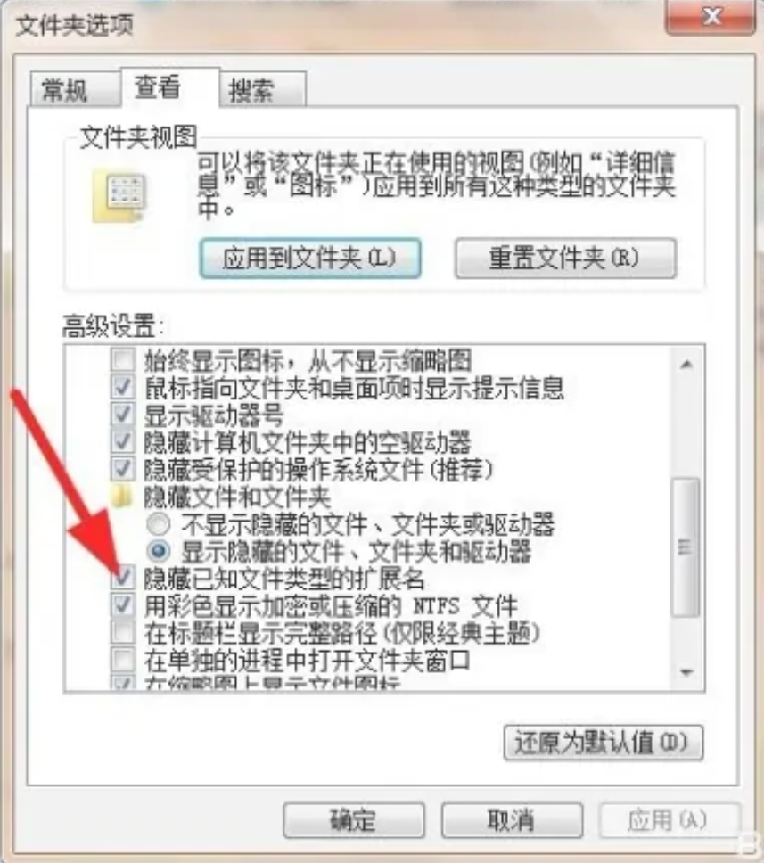

# Tool Kits

- 文件、文件夹、桌面菜单添加程序（项）[link](https://blog.csdn.net/Mrceel/article/details/107459678#:~:text=win10 给右键文件、文件夹、桌面菜单添加程序（项） 1 在空白处右键（桌面右键）,2 在文件上右键 3 在文件夹上右键)
- URL Decode / Encode [link](https://www.urldecoder.io/)

# Install Tutorial

### 1. Software List

 **Daily Use**

| Software name | Url                              |
| ------------- | -------------------------------- |
| 网易云音乐    | https://music.163.com/#/download |
| QQ            | https://im.qq.com/pcqq           |
| Wechat        |                                  |
| 火绒          |                                  |
| Winrar        |                                  |
| 桌面日历      |                                  |

**Work Use**

| Software name     | Url                                                          |
| ----------------- | ------------------------------------------------------------ |
| Pycharm           | https://www.jetbrains.com/pycharm/                           |
| InteliJ IDEA      | https://www.jetbrains.com/idea/download/download-thanks.html?platform=windows |
| Clion             |                                                              |
| Typora            | https://typoraio.cn/                                         |
| Git               |                                                              |
| Clark for Windows | https://github.com/Fndroid/clash_for_windows_pkg             |
| KeePass           | https://keepass.info/download.html                           |
| Fork              |                                                              |

VS Code Configuration

| Plugin Name          | Functions                       |
| -------------------- | ------------------------------- |
| Chinese (Simplified) | 中文翻译                        |
| GitLens              | 显示git commit的时间以及细节... |
|                      |                                 |

### 2. Configuration

- 调整系统图标，显示大小：
  - 桌面右键点开`显示设置`
  - 缩放与布局 --- 225%
  
- 设置显示扩展名，显示隐藏文件
  - 文件资源管理器选项
  
    

- 设置系统不检测更新：https://jingyan.baidu.com/article/4d58d5411e35de9dd4e9c0cb.html